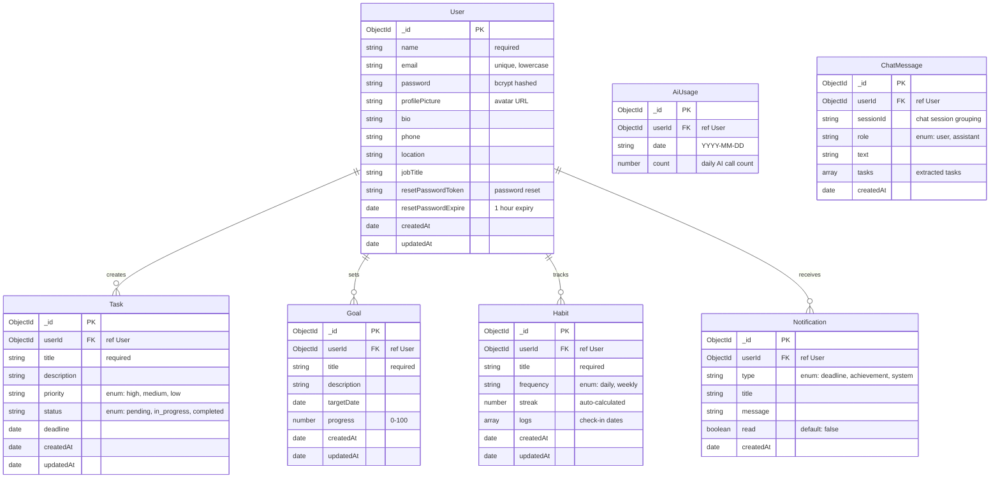

<p align="center">
  <picture>
    <source media="(prefers-color-scheme: dark)" srcset="https://readme-typing-svg.herokuapp.com?font=Fira+Code&weight=700&size=32&duration=3200&pause=600&color=818CF8&center=true&vCenter=true&width=580&height=80&lines=FlowSync+AI;AI-Powered+Productivity+OS;Plan+Smarter+%E2%80%A2+Focus+Better;Never+Miss+a+Deadline+Again">
    
  </picture>
</p>

<p align="center">
  <b>An AI-Powered Productivity Operating System</b><br>
  <i>Proactively analyze, prioritize, and execute — before deadlines become crises.</i>
</p>

<p align="center">
  <a href="https://flowsyncai30.vercel.app"></a>
  <a href="https://github.com/Shubham-997800/FlowSync-Ai"></a>
  <a href="https://github.com/Shubham-997800/FlowSync-Ai/stargazers"></a>
</p>

<p align="center">
  
  
  
  
  
  
  
  
  
  
  
  
  
  
</p>

<br>

---

## 📦 Table of Contents

- [Problem Statement](#-problem-statement)
- [Why FlowSync AI?](#-why-flowsync-ai)
- [Key Features](#-key-features)
- [Screenshots](#-screenshots)
- [Tech Stack](#-tech-stack)
- [System Architecture](#-system-architecture)
- [Project Workflow](#-project-workflow)
- [Folder Structure](#-folder-structure)
- [Database Schema](#-database-schema)
- [API Architecture](#-api-architecture)
- [AI Architecture](#-ai-architecture)
- [Request Lifecycle](#-request-lifecycle)
- [Authentication Flow](#-authentication-flow)
- [License & Usage](#-license--usage)
- [Author](#-author)
- [Acknowledgements](#-acknowledgements)

---

## 🧠 Problem Statement

### The Productivity Paradox

The average professional uses **3.1 task management tools** simultaneously. Yet **41% of all tasks** remain incomplete. Deadlines slip. Priorities shift. Burnout rises.

Traditional to-do apps fail because they treat productivity as **data entry** — you input tasks, the app stores them, and then sends a passive reminder that you ignore.

```
Current tools:    Input → Store → Remind → Ignore ✓
What we need:     Input → Analyze → Prioritize → Execute
```

### Why Reminders Fail


Reminders treat the symptom (forgetting) without addressing the root cause: **overwhelm and lack of intelligent prioritization**.

### How FlowSync AI Solves This

FlowSync AI replaces passive storage with **active intelligence**. Instead of asking "what's due?", it asks "what matters most right now?" and reshapes your day accordingly.

```
FlowSync AI:  Input → AI Analysis → Priority Engine → Rescue Mode → Execute → Adapt
```

> [!NOTE]
> FlowSync AI is not a to-do list. It is a **decision engine** that uses AI (OpenRouter + Qwen 2.5 7B) to understand context, predict risk, and optimize every minute of your day.

---

## 🚀 Why FlowSync AI?

### The Vision

We believe productivity tools should work **for** you, not the other way around. The future of task management is **proactive**, not reactive. FlowSync AI was built on three core principles:

| Principle | What It Means |
|-----------|---------------|
| **AI-First, Not AI-Wrapped** | AI isn't a chatbot bolted onto a to-do list. It's the core engine that analyzes, prioritizes, and replans every task in real time. |
| **Proactive > Reactive** | Instead of waiting for you to miss a deadline, FlowSync predicts the risk and suggests corrective action before it's too late. |
| **Context-Aware Execution** | The system understands your workload, your deadlines, your priorities, and your capacity — then builds a schedule that fits. |

### What Makes It Different

| Feature | Traditional To-Do Apps | FlowSync AI |
|---------|----------------------|-------------|
| Task Creation | Manual only | Natural language via AI chat |
| Prioritization | User-defined (static) | AI-driven urgency scores + risk analysis |
| Daily Planning | None or manual | AI-generated optimized time blocks |
| Overload Handling | "You have 12 tasks due" | Rescue Mode — AI replans and compresses |
| Focus Integration | Separate app | Built-in Pomodoro with task sync |
| Habit Tracking | Standalone | Unified with tasks and goals |
| Analytics | Completion % | AI productivity coach with trends |
| Deadline Risk | None | Predictive risk scoring |

---

## ✨ Key Features

### 🤖 AI Capabilities

| Feature | Description |
|---------|-------------|
| **AI Chat Assistant** | Conversational interface — say "Schedule a standup at 10am tomorrow" and the task is created, prioritized, and slotted into your calendar. Chat history is persisted to the database across sessions. |
| **AI Chat History** | Every conversation is saved to MongoDB — browse past chats, delete individual messages, or clear entire history with "New Chat" button. |
| **Multilingual AI Chat** | Auto-detects user language (Hindi, Hinglish, English, Spanish, etc.) and responds in the same language — including Hinglish (Devanagari + English mix). |
| **Smart Daily Planning** | AI analyzes all pending tasks, deadlines, and priorities to generate an optimal day schedule with focused work blocks, breaks, and buffers. |
| **Task Prioritization Engine** | Every task receives a dynamic urgency score (0–100) and risk score (0–100) based on deadline proximity, dependencies, and current workload. |
| **Rescue Mode** | When the day is overloaded, AI identifies what's critical, what can be dropped, and compresses the remaining work into a survivable plan. |
| **AI Task Suggestions** | While typing a task title, AI suggests optimal priority, estimated time, and relevant tags in real-time. |
| **AI Dashboard Coach** | AI-powered productivity recommendations on the dashboard based on actual task data, urgency scores, and risk analysis. |
| **AI Calendar Preview** | Shows AI-priority-ranked tasks per day with risk scores for smarter scheduling. |
| **AI Focus Mode** | Context-aware break timing suggestions based on task priority and overdue status (shorter blocks for urgent tasks, longer for deep work). |
| **Productivity Coach** | AI-generated reports that highlight patterns, strengths, weaknesses, and actionable recommendations via the analytics-insights API. |
| **AI Consent System** | Privacy-first opt-in for AI features, managed from Settings with full visibility. |
| **200/day Usage Limit** | Per-user daily AI call quota with usage tracking via `/api/ai/usage` endpoint. |
| **Voice Input** | Speech-to-text via Web Speech API in the AI chat interface for hands-free task creation. |

### 📋 Core Features

| Category | Feature | Details |
|----------|---------|---------|
| 🔐 **Auth** | Secure Login / Signup | JWT-based with bcrypt hashing, forgot/reset password via email |
| 📝 **Tasks** | Full CRUD | Priority levels, status tracking, deadlines, descriptions, field sanitization |
| 🎯 **Goals** | Milestone Tracking | Target dates, progress percentage, aligned with tasks |
| 🔄 **Habits** | Streak Tracking | Daily/weekly frequency, auto-calculated streaks, visual weekly grid |
| 📅 **Calendar** | Multi-View | Monthly, weekly, and daily views with AI-priority-ranked task suggestions |
| ⏱️ **Focus Mode** | Pomodoro Timer | Configurable focus (1–180 min) and break (1–60 min) durations, ambient sounds, task integration, AI break timing suggestions |
| 📊 **Analytics** | Deep Insights | Productivity score (animated ring chart), completion rates, weekly/monthly trends, focus session stats, AI-generated report |
| 🏆 **Achievements** | Gamification | Milestone-based achievements (tasks, goals, focus) with MongoDB persistence |
| 🔔 **Notifications** | Real-Time Drawer | All/Unread filters, grouped by Today / This Week / Earlier, auto deadline reminders |
| 🏠 **Dashboard** | Command Center | Task stats, AI priority cards (live API), calendar preview, focus timer, productivity score, deadline risk indicators |
| ⚙️ **Settings** | Full Control | Theme toggle (light/dark/system), AI consent toggle, profile editing, account deletion |
| 👤 **Profile** | Customizable | Avatar upload, bio, phone, location, job title, password change |
| 🎤 **Voice Input** | Speech-to-Text | Browser-native Web Speech API for AI chat and task creation |
| 🌙 **Dark Mode** | Three Themes | Light, dark, and system-follow with smooth CSS transitions |
| 📧 **Email Reminders** | Auto Notifications | Scheduled service that generates deadline alerts every 30 minutes |

---

## 📸 Screenshots

> *Live demo available at [flowsyncai30.vercel.app](https://flowsyncai30.vercel.app)*

| Page | Preview |
|------|---------|
| **Landing Page** | `_Coming Soon_` |
| **Dashboard** | `_Coming Soon_` |
| **Task Manager** | `_Coming Soon_` |
| **AI Planner** | `_Coming Soon_` |
| **Calendar** | `_Coming Soon_` |
| **Focus Mode** | `_Coming Soon_` |
| **Analytics** | `_Coming Soon_` |
| **Settings** | `_Coming Soon_` |

---

## 🛠️ Tech Stack

### Frontend

| Technology | Version | Purpose | Why We Chose It |
|------------|---------|---------|-----------------|
| **React** | 19 | UI component library | Mature ecosystem, concurrent features, server components |
| **Vite** | 8 | Build tool & dev server | Sub-second HMR, native ESM, optimized production builds |
| **Tailwind CSS** | 4 | Utility-first styling | Rapid prototyping, consistent design system, dark mode |
| **Framer Motion** | Latest | Animation library | Declarative animations, gesture support, layout transitions |
| **React Router** | 7 | Client-side routing | Lazy loading, nested routes, data loading patterns |
| **Axios** | 1 | HTTP client | Interceptors for JWT, request/response transformations |
| **Lucide React** | Latest | Icon library | Consistent, tree-shakeable SVG icon set |
| **React Hot Toast** | 2 | Toast notifications | Lightweight, customizable, promise-based API |
| **React Helmet Async** | Latest | SEO & meta tags | Sets title, OG tags, Twitter cards dynamically |

### Backend

| Technology | Version | Purpose | Why We Chose It |
|------------|---------|---------|-----------------|
| **Node.js** | 24+ | JavaScript runtime | Non-blocking I/O, vast ecosystem, modern JS features |
| **Express** | 4 | Web framework | Minimal, flexible, extensive middleware ecosystem |
| **Mongoose** | 9 | MongoDB ODM | Schema validation, middleware hooks, population queries |
| **MongoDB Atlas** | — | Cloud database | Free tier, auto-scaling, global replication, built-in monitoring |
| **jsonwebtoken** | 9 | JWT auth | Stateless authentication, industry standard |
| **bcryptjs** | 3 | Password hashing | 10 salt rounds, constant-time comparison |
| **Helmet** | 8 | Security headers | XSS, clickjacking, MIME sniffing protection |
| **express-rate-limit** | 8 | Rate limiting | Per-endpoint configurable limits |
| **nodemailer** | Latest | Email service | Password reset emails, HTML templates |

### AI & Infrastructure

| Technology | Purpose |
|------------|---------|
| **OpenRouter** | AI chat, planning, prioritization, rescue mode — Qwen 2.5 7B via OpenAI-compatible SDK |
| **Vercel** | Frontend hosting with auto-deploy from GitHub, edge CDN |
| **Railway** | Backend hosting with auto-deploy from GitHub, HTTPS, zero-downtime deploys |

---

## 🏗️ System Architecture

```
┌─────────────────────────────────────────────────────────────────────────┐
│                        🌐 DNS (Vercel CDN)                             │
│                      flowsyncai30.vercel.app                           │
├─────────────────────────────────────────────────────────────────────────┤
│                                                                         │
│  ┌───────────────────── FRONTEND (Vercel) ───────────────────────────┐  │
│  │                                                                   │  │
│  │  React 19 + Vite 8 + Tailwind 4 + Framer Motion                  │  │
│  │                                                                   │  │
│  │  ┌─────────┐ ┌───────────┐ ┌──────────┐ ┌──────────┐            │  │
│  │  │ Landing │ │ Dashboard │ │  Tasks   │ │ Calendar │            │  │
│  │  │  Page   │ │  + Stats  │ │ + Goals  │ │ + Views  │            │  │
│  │  ├─────────┤ ├───────────┤ ├──────────┤ ├──────────┤            │  │
│  │  │AI Plan. │ │  Focus    │ │ Analytics│ │  Habits  │            │  │
│  │  │Chat+Plan│ │  Timer    │ │ + Reports│ │ + Streaks│            │  │
│  │  ├─────────┤ ├───────────┤ ├──────────┤ ├──────────┤            │  │
│  │  │Settings │ │  Profile  │ │Notificat.│ │   Auth   │            │  │
│  │  │+ Theme  │ │ + Avatar  │ │ + Filters│ │ + JWT    │            │  │
│  │  └─────────┘ └───────────┘ └──────────┘ └──────────┘            │  │
│  └───────────────────────────────────────────────────────────────────┘  │
│                                  │                                       │
│                    HTTPS + JSON + JWT Bearer Token                       │
│                                  ▼                                       │
│  ┌───────────────────── BACKEND (Railway) ───────────────────────────┐  │
│  │                                                                   │  │
│  │  Express 4 + Mongoose 9 + Helmet 8 + Rate Limiter                │  │
│  │                                                                   │  │
│  │  ┌──────────┐  ┌──────────┐  ┌──────────┐  ┌──────────┐         │  │
│  │  │  Auth    │  │  Tasks   │  │  Goals   │  │  Habits  │         │  │
│  │  │  Ctrl    │  │  Ctrl    │  │  Ctrl    │  │  Ctrl    │         │  │
│  │  ├──────────┤  ├──────────┤  ├──────────┤  ├──────────┤         │  │
│  │  │Analytics │  │ Settings │  │Notificat.│  │   AI     │         │  │
│  │  │  Ctrl    │  │  Ctrl    │  │  Ctrl    │  │  Ctrl    │         │  │
│  │  └──────────┘  └──────────┘  └──────────┘  └──────────┘         │  │
│  │                                                                   │  │
│  │  Middleware: JWT Auth → Rate Limiter → Helmet → CORS → Morgan    │  │
│  └───────────────────────────────────────────────────────────────────┘  │
│                                  │                                       │
│                     ┌────────────┴────────────┐                         │
│                     ▼                         ▼                         │
│  ┌────────────────────────┐    ┌────────────────────────┐               │
│  │   🗄️ MongoDB Atlas     │    │   🤖 OpenRouter AI    │               │
│  │                        │    │                        │               │
│  │   Users    Tasks       │    │  OpenAI-compatible     │               │
│  │   Goals    Habits      │    │  chat.completions      │               │
│  │   Notifications        │    │  Structured JSON       │               │
│  └────────────────────────┘    └────────────────────────┘               │
│                                                                         │
└─────────────────────────────────────────────────────────────────────────┘
```

---

## 🔄 Project Workflow

```
                    ┌─────────────┐
                    │  👤 User    │
                    │  Arrives    │
                    └──────┬──────┘
                           ▼
                    ┌─────────────┐
                    │  🔐 Auth    │
                    │  Login/Sign │
                    └──────┬──────┘
                           ▼ (JWT Issued)
              ┌──────────────────────────┐
              │      🏠 Dashboard        │
              │  Task Stats  │  AI Cards │
              │  Calendar   │  Focus     │
              │  Risk Alerts│  Score     │
              └──────┬───────────────────┘
                     │
      ┌──────────────┼──────────────┬──────────────┐
      ▼              ▼              ▼              ▼
┌──────────┐ ┌────────────┐ ┌──────────┐ ┌──────────────┐
│ 📝 Tasks │ │ 🎯 Goals   │ │ 🔄 Habits│ │ 📅 Calendar  │
│ Create   │ │ Set Target │ │ Check In │ │ View Tasks   │
│ Edit     │ │ Track %    │ │ Streak   │ │ Filter by    │
│ Priorit. │ │ Align Tasks│ │ Weekly   │ │ Month/Week   │
└────┬─────┘ └──────┬─────┘ └────┬─────┘ └──────┬───────┘
     │              │            │              │
     └──────────────┴─────┬──────┘              │
                          ▼                     │
              ┌─────────────────────┐            │
              │  🤖 AI Service      │            │
              │                     │            │
              │  Prompt Engineering │            │
              │         ▼           │            │
               │  OpenRouter API     │            │
              │         ▼           │            │
              │  Structured JSON    │            │
              │         ▼           │            │
              │  Response Parser    │            │
              └──────────┬──────────┘            │
                         ▼                       │
              ┌─────────────────────┐            │
              │  AI Outputs         │            │
              │                     │            │
              │  • Priority Scores  │            │
              │  • Daily Schedule   │            │
              │  • Rescue Plan      │            │
              │  • Chat Reply       │            │
              └──────────┬──────────┘            │
                         │                       │
                         ▼                       ▼
              ┌──────────────────────────────────────┐
              │         📊 Analytics Engine          │
              │                                      │
              │  Stats → Weekly → Monthly → Trends   │
              │  Focus Sessions → Completion Rates   │
              └──────────────────┬───────────────────┘
                                 ▼
                    ┌─────────────────────┐
                    │  🔔 Notifications    │
                    │  Real-time updates   │
                    │  Deadline alerts     │
                    └─────────────────────┘
```

---

## 📁 Folder Structure

```
flowsync-ai/
│
├── client/                                # 🎨 React Frontend
│   ├── public/
│   │   └── favicon.ico
│   ├── src/
│   │   ├── main.jsx                       # Entry point
│   │   ├── App.jsx                        # Root component
│   │   ├── index.css                      # Tailwind v4 config (import + dark variant + font)
│   │   │
│   │   ├── routes/
│   │   │   └── AppRoutes.jsx              # Lazy-loaded route definitions
│   │   │
│   │   ├── layouts/
│   │   │   └── MainLayout.jsx             # Sidebar + header + theme wrapper
│   │   │
│   │   ├── context/
│   │   │   ├── AuthContext.jsx            # Auth state (useReducer-based)
│   │   │   └── ThemeContext.jsx           # Dark/light/system theme
│   │   │
│   │   ├── services/
│   │   │   ├── api.js                     # Axios instance + JWT interceptor
│   │   │   ├── authService.js
│   │   │   ├── taskService.js
│   │   │   ├── goalService.js
│   │   │   ├── habitService.js
│   │   │   ├── analyticsService.js
│   │   │   ├── notificationService.js
│   │   │   ├── settingsService.js
│   │   │   ├── aiService.js
│   │   │   ├── pushService.js
│   │   │   └── chatService.js               # Chat history API layer
│   │   │
│   │   ├── components/
│   │   │   ├── Sidebar.jsx                # Navigation sidebar
│   │   │   ├── NotificationPopup.jsx      # Real-time notification drawer
│   │   │   └── ui/                        # Reusable primitives
│   │   │       ├── Card.jsx
│   │   │       ├── Badge.jsx
│   │   │       ├── StatCard.jsx
│   │   │       ├── ProgressBar.jsx
│   │   │       ├── Modal.jsx
│   │   │       └── LoadingSpinner.jsx
│   │   │
│   │   ├── pages/
│   │   │   ├── Landing/                   # Hero, Features, HowItWorks, CTA, Footer (popup modals for legal)
│   │   │   ├── Authentication/            # Login, Register, ForgotPassword, ResetPassword
│   │   │   ├── Dashboard/                 # Stats, AI cards, calendar, focus, risk
│   │   │   ├── TaskManager/               # Task list + Goal manager
│   │   │   ├── Calendar/                  # Monthly/weekly/daily views
│   │   │   ├── FocusMode/                 # Pomodoro timer + settings
│   │   │   ├── Habits/                    # Weekly tracker + streaks
│   │   │   ├── AIPlanner/                 # AI chat, schedule, priority, rescue
│   │   │   ├── Analytics/                 # Charts, trends, AI report
│   │   │   ├── Notifications/             # Notification center
│   │   │   ├── Settings/                  # Theme, AI prefs, danger zone
│   │   │   ├── Profile/                   # Avatar, personal info, password
│   │   │   ├── Legal/                     # Terms of Service, Privacy Policy
│   │   │   └── Error/                     # 404, 401 pages
│   │   │
│   │   └── hooks/                         # Custom React hooks
│   │       ├── useTheme.js
│   │       ├── useAuth.js
│   │       └── useMediaQuery.js
│   │
│   ├── vercel.json                        # SPA routing for Vercel
│   └── package.json
│
├── flowsync-backend/                      # ⚙️ Express API Server
│   ├── server.js                          # Entry point, middleware, route mounting
│   │
│   ├── config/
│   │   ├── db.js                          # Mongoose connection with retry logic
│   │   └── aiConfig.js                    # OpenRouter client (OpenAI SDK)
│   │
│   ├── middleware/
│   │   ├── auth.js                        # JWT verification
│   │   └── rateLimiter.js                 # Rate limiting strategies
│   │
│   ├── models/
│   │   ├── User.js                        # name, email, hashed password, profile, resetToken, achievements[], aiConsent
│   │   ├── Task.js                        # title, priority, status, deadline, description
│   │   ├── Goal.js                        # title, targetDate, progress
│   │   ├── Habit.js                       # title, frequency, streak, logs[]
│   │   ├── Notification.js                # type, title, message, status, userId
│   │   ├── PushSubscription.js            # endpoint, keys for web push
│   │   ├── ChatMessage.js                 # role, text, tasks[], createdTasks[]
│   │   └── AiUsage.js                     # user, date, count (200/day limit)
│   │
│   ├── controllers/
│   │   ├── authController.js              # signup, login, forgotPassword, resetPassword
│   │   ├── taskController.js              # CRUD with sanitization
│   │   ├── goalController.js              # CRUD with sanitization
│   │   ├── habitController.js             # CRUD + check-in + streak calculation
│   │   ├── analyticsController.js         # Stats, weekly, monthly aggregation
│   │   ├── notificationController.js      # Create, list, mark-read
│   │   ├── settingsController.js          # Profile, avatar, password, delete account, achievements, AI consent
│   │   ├── aiController.js               # Chat, plan, prioritize, rescue, suggest-task, usage, analytics-insights
│   │   ├── pushController.js             # Web push subscribe/unsubscribe
│   │   └── chatController.js             # Chat history get/save/delete/clear
│   │
│   ├── routes/
│   │   ├── authRoutes.js
│   │   ├── taskRoutes.js
│   │   ├── goalRoutes.js
│   │   ├── habitRoutes.js
│   │   ├── analyticsRoutes.js
│   │   ├── notificationRoutes.js
│   │   ├── settingsRoutes.js
│   │   ├── aiRoutes.js
│   │   ├── pushRoutes.js
│   │   └── chatRoutes.js                 # Chat history CRUD
│   │
│   ├── services/
│   │   ├── aiService.js                   # Prompt engineering + JSON parsing (7 models, multilingual, failover)
│   │   ├── emailService.js                # Nodemailer — password reset
│   │   └── reminderService.js             # Auto deadline alerts every 30 minutes
│   │
│   ├── seed.js                            # Local DB seed script
│   └── qa-seed.js                         # Remote API-based QA seed script
│   │
│   └── package.json
│
├── .gitignore
├── README.md
└── LICENSE
```

---

## 🗄️ Database Schema

### Entity-Relationship Diagram



### Relationship Details

| Entity | Relation | Cardinality | Description |
|--------|----------|-------------|-------------|
| **User → Task** | One-to-Many | `1 : N` | A user can create unlimited tasks. Each task belongs to exactly one user. |
| **User → Goal** | One-to-Many | `1 : N` | Goals are user-scoped. Tasks can optionally align to goals via title matching. |
| **User → Habit** | One-to-Many | `1 : N` | Each habit is tracked independently per user. Streaks auto-calculate from log dates. |
| **User → Notification** | One-to-Many | `1 : N` | Notifications are generated by the system (deadline alerts, achievement unlocks). |
| **User → AiUsage** | One-to-Many | `1 : N` | Daily AI usage counters reset each day. |
| **User → ChatMessage** | One-to-Many | `1 : N` | Chat history persisted per user session. |

> [!NOTE]
> The `password` field is excluded from all API responses via Mongoose's `toJSON` transform. The `resetPasswordToken` and `resetPasswordExpire` fields are cleared after a successful password reset.

---

## 🌐 API Architecture

```
┌──────────────────────────────────────────────────────────────────────┐
│                         📱 CLIENT (React)                           │
│                                                                      │
│   ┌────────────┐   ┌────────────┐   ┌────────────┐                  │
│   │  Auth Page  │   │ Dashboard  │   │ AI Planner │    ...           │
│   └──────┬─────┘   └──────┬─────┘   └──────┬─────┘                  │
│          │                │                │                         │
│          └────────────────┼────────────────┘                         │
│                           │                                          │
│                    ┌──────▼──────┐                                    │
│                    │  Axios API  │                                    │
│                    │  Service    │                                    │
│                    │  + JWT      │                                    │
│                    └──────┬──────┘                                    │
└───────────────────────────┼──────────────────────────────────────────┘
                            │
                      HTTPS / JSON
                            │
┌───────────────────────────▼──────────────────────────────────────────┐
│                         🖥️ EXPRESS SERVER (Railway)                   │
│                                                                      │
│   ┌──────────────────────────────────────────────────────┐          │
│   │                 MIDDLEWARE PIPELINE                   │          │
│   │                                                       │          │
│   │   Helmet → CORS → Morgan → Rate Limiter → JSON Parse │          │
│   └──────────────────────┬───────────────────────────────┘          │
│                          │                                           │
│                    ┌─────▼──────┐                                    │
│                    │   Router   │                                    │
│                    └──┬──┬──┬──┘                                    │
│          ┌────────────┘  │  └────────────┐                          │
│          ▼               ▼               ▼                           │
│  ┌────────────┐  ┌────────────┐  ┌────────────┐                    │
│  │  Auth      │  │  Tasks     │  │    AI      │    ...              │
│  │  Routes    │  │  Routes    │  │  Routes    │                     │
│  └──────┬─────┘  └──────┬─────┘  └──────┬─────┘                    │
│         │               │               │                            │
│         ▼               ▼               ▼                            │
│  ┌────────────┐  ┌────────────┐  ┌────────────┐                    │
│  │  Auth      │  │  Task      │  │    AI      │                     │
│  │Controller  │  │Controller  │  │Controller  │                     │
│  └──────┬─────┘  └──────┬─────┘  └──────┬─────┘                    │
│         │               │               │                            │
│         ▼               ▼               ▼                            │
│  ┌────────────┐  ┌────────────┐  ┌────────────┐                    │
│  │  Services  │  │  Mongoose  │  │  AI        │                     │
│  │  (Email)   │  │  Models    │  │  Service   │                     │
│  └────────────┘  └──────┬─────┘  └──────┬─────┘                    │
│                         │               │                            │
└─────────────────────────┼───────────────┼──────────────────────────┘
                          ▼               ▼
              ┌────────────────────┐  ┌────────────────────┐
               │   🗄️ MongoDB Atlas │  │  🤖 OpenRouter AI │
              │                    │  │                    │
              │  5 Collections    │  │  OpenAI SDK        │
              │  Indexed Queries  │  │  Structured JSON   │
              └────────────────────┘  └────────────────────┘
```

---

## 🤖 AI Architecture

FlowSync AI's intelligence is powered by **OpenRouter** with **7 AI models** in a failover chain (Llama 3.3 70B, GPT-4o-mini, Claude 3 Haiku, Gemini 2.0 Flash, Mistral 7B, DeepSeek V3, Qwen 2.5 7B), accessed through the **OpenAI-compatible SDK**. The AI layer is designed for reliability, structured output, graceful fallbacks, and multilingual support.

### Architecture Overview

```
┌──────────────────────────────────────────────────────────────────────┐
│                         AI SERVICE LAYER                              │
│                                                                       │
│  ┌──────────────────────────────────────────────────────────┐        │
│  │                    SYSTEM PROMPT                          │        │
│  │                                                            │        │
│  │  "You are FlowSync AI, a productivity engine. Always       │        │
│  │   respond with valid JSON only. No markdown, no            │        │
│  │   explanations."                                           │        │
│  └──────────────────────────┬───────────────────────────────┘        │
│                             │                                         │
│  ┌──────────────────────────▼───────────────────────────────┐        │
│  │                   PROMPT BUILDER                          │        │
│  │                                                            │        │
│  │  Injects: user message + current tasks + context           │        │
│  │                                                            │        │
│  │  Output: fully constructed prompt ready for API call       │        │
│  └──────────────────────────┬───────────────────────────────┘        │
│                             │                                         │
│  ┌──────────────────────────▼───────────────────────────────┐        │
│  │              OpenRouter API (via OpenAI SDK)               │        │
│  │                                                            │        │
│  │  Endpoint: https://openrouter.ai/api/v1                    │        │
│  │  Model:    qwen/qwen-2.5-7b-instruct                      │        │
│  │  Temp:     0.3 (deterministic output)                     │        │
│  │                                                            │        │
│  │  Response: structured JSON string                          │        │
│  └──────────────────────────┬───────────────────────────────┘        │
│                             │                                         │
│  ┌──────────────────────────▼───────────────────────────────┐        │
│  │                  JSON RESPONSE PARSER                     │        │
│  │                                                            │        │
│  │  1. Strip markdown code fences (```json ... ```)           │        │
│  │  2. Attempt JSON.parse()                                   │        │
│  │  3. If fails → find first { and last } -> slice + parse   │        │
│  │  4. If all fails → return default fallback structure       │        │
│  │                                                            │        │
│  │  Output: validated JSON object                             │        │
│  └──────────────────────────┬───────────────────────────────┘        │
│                             │                                         │
│  ┌──────────────────────────▼───────────────────────────────┐        │
│  │               ERROR HANDLING & FALLBACKS                  │        │
│  │                                                            │        │
│  │  • 429 Rate Limit: return AI_SERVICE_UNAVAILABLE           │        │
│  │  • Parse failure: return sensible defaults                 │        │
│  │  • Network error: return cached last response (future)     │        │
│  └──────────────────────────────────────────────────────────┘        │
└──────────────────────────────────────────────────────────────────────┘
```

### AI Capabilities Breakdown

| Capability | Prompt Strategy | Response Format | Fallback |
|------------|----------------|----------------|---------|
| **Chat** | User message + current tasks context | `{ reply, tasks[], suggestions[] }` | Default polite response |
| **Multilingual Chat** | Language detection from user input, responds in same language (Hinglish, Hindi, English, Spanish, etc.) | Same as Chat | Default English |
| **Daily Plan** | User prompt + task list with deadlines | `{ priority[], schedule[], suggestions[], confidence }` | Empty plan |
| **Prioritize** | Task list with IDs, titles, priorities | `{ rankings[], suggestedOrder[], summary }` | Equal scores |
| **Rescue Mode** | Overloaded task list, 48h window | `{ criticalTasks[], compressedSchedule[], dropRecommendations[] }` | Empty arrays |
| **Suggest Task** | Task title + existing tasks context | `{ suggestedPriority, suggestedEstimatedTime, suggestedTags[], reason }` | Medium priority defaults |
| **Analytics Insights** | Full task/habit/goal data | `{ strengths[], weaknesses[], recommendations[], productivityScore, predictedCompletionRate }` | Static fallback |
| **Voice Input** | Web Speech API → text → AI chat | Same as Chat | Text input fallback |

---

## ⚡ Request Lifecycle

```
                      ┌────────────────┐
                      │  🌐 Browser    │
                      │  HTTP Request  │
                      └───────┬────────┘
                              │
                      ┌───────▼────────┐
                      │  React Router  │
                      │  (Lazy Load)   │
                      └───────┬────────┘
                              │
                      ┌───────▼────────┐
                      │  Axios Call    │
                      │  + JWT Header  │
                      └───────┬────────┘
                              │
              ┌───────────────┼───────────────┐
              │               │               │
        ┌─────▼─────┐  ┌─────▼─────┐  ┌─────▼─────┐
        │  Auth     │  │  Rate     │  │  Helmet   │
        │  Middle.  │  │  Limiter  │  │  Security │
        └─────┬─────┘  └─────┬─────┘  └─────┬─────┘
              │               │               │
              └───────────────┼───────────────┘
                              │
                      ┌───────▼────────┐
                      │  Express Route │
                      │  (Router)      │
                      └───────┬────────┘
                              │
                      ┌───────▼────────┐
                      │  Controller    │
                      │  (Validation)  │
                      └───────┬────────┘
                              │
              ┌───────────────┼───────────────┐
              │               │               │
        ┌─────▼─────┐  ┌─────▼─────┐  ┌─────▼─────┐
         │  MongoDB  │  │ OpenRouter│  │  Email    │
        │  Query    │  │  API Call │  │  Service  │
        └─────┬─────┘  └─────┬─────┘  └─────┬─────┘
              │               │               │
              └───────────────┼───────────────┘
                              │
                      ┌───────▼────────┐
                      │  JSON Response │
                      │  + Status Code │
                      └───────┬────────┘
                              │
                      ┌───────▼────────┐
                      │  Axios Res.    │
                      │  Interceptor   │
                      └───────┬────────┘
                              │
                      ┌───────▼────────┐
                      │  React State   │
                      │  Update + UI   │
                      └───────┬────────┘
                              │
                      ┌───────▼────────┐
                      │  🎨 Render    │
                      └────────────────┘
```

---

## ⚡ Performance & Build Optimizations

```
┌─────────────────────────────────────────────────────────────────┐
│                    BUNDLE BREAKDOWN (Code Splitting)             │
├─────────────────────────────────────────────────────────────────┤
│  vendor (React 19)     181 kB  │  motion (Framer Motion) 125 kB│
│  utils (Axios, etc.)    73 kB  │  router (React Router)   42 kB│
│  icons (Lucide)         25 kB  │  app code                56 kB│
└─────────────────────────────────────────────────────────────────┘
```

| Optimization | Implementation |
|-------------|---------------|
| **Code Splitting** | `manualChunks` splits vendor, router, motion, icons, utils into separate cacheable bundles |
| **Lazy Loading** | All pages loaded via `React.lazy()` + `Suspense` — only requested code loads |
| **Skeleton Loading** | `LoadingSpinner` with `page` prop renders full skeleton layout (pulse animation) instead of basic spinner |
| **Font Loading** | Google Fonts (Inter) loaded via `<link preload>` + `preconnect` — no render blocking |
| **Scroll Performance** | `will-change-transform` on animated elements, passive scroll listeners, `content-visibility` via framer-motion |
| **Animation Performance** | All animations handled by framer-motion (GPU-accelerated) — zero CSS `@keyframes` |
| **React.memo** | All landing page sections wrapped with `React.memo` — prevent unnecessary re-renders |
| **CSS Size** | Minimal CSS — Tailwind v4 purges unused styles; only ~62 kB (10.5 kB gzip) |
| **SEO** | Dynamic `<title>`, meta description, OG tags, Twitter cards via `react-helmet-async` |

---

## 🔐 Authentication Flow

```
                        ┌─────────────────────┐
                        │  📝 SIGNUP           │
                        │                     │
                        │  name + email + pw  │
                        └──────────┬──────────┘
                                   │
                                   ▼
                        ┌─────────────────────┐
                        │  bcrypt.hash(pw,10) │
                        │  Save to MongoDB    │
                        └──────────┬──────────┘
                                   │
                                   ▼
                        ┌─────────────────────┐
                        │  jwt.sign({ id })   │
                        │  Expires: 30 days   │
                        └──────────┬──────────┘
                                   │
                                   ▼
                    ┌─────────────────────────────┐
                    │  Response: { token, user }  │
                    │  (password excluded via     │
                    │   Mongoose toJSON transform) │
                    └──────────┬──────────────────┘
                               │
          ┌────────────────────┼────────────────────┐
          │                    │                    │
          ▼                    ▼                    ▼
  ┌──────────────┐   ┌────────────────┐   ┌──────────────┐
  │  🔐 LOGIN    │   │  🔄 FORGOT PW  │   │  🚪 LOGOUT   │
  │              │   │                │   │              │
  │ email + pw   │   │ email → token  │   │ Clear token  │
  │      ▼       │   │      ▼         │   │ from client  │
  │ bcrypt.check │   │ send email     │   │              │
  │      ▼       │   │      ▼         │   │              │
  │ jwt.sign()   │   │ verify token   │   │              │
  │      ▼       │   │      ▼         │   │              │
  │ return token │   │ set new pw     │   │              │
  └──────────────┘   └────────────────┘   └──────────────┘

                    ┌─────────────────────────────┐
                    │  🛡️ PROTECTED ROUTES        │
                    │                              │
                    │  Request → Authorization:    │
                    │  Bearer <token>              │
                    │         ↓                    │
                    │  jwt.verify(token)           │
                    │         ↓                    │
                    │  Pass or 401 Unauthorized    │
                    └──────────────────────────────┘
```

---

## 📄 License & Usage

### Proprietary License

**Copyright © 2024-2026 Shubham Dangi. All rights reserved.**

This software and its source code are the intellectual property of **Shubham Dangi**. It is **not** open-source software.

| Right | Allowed? | Details |
|-------|----------|---------|
| View Code | ✅ Yes | Public on GitHub for portfolio/reference |
| Run for Personal Use | ✅ Yes | You may run the live version at [flowsyncai30.vercel.app](https://flowsyncai30.vercel.app) |
| Fork/Clone | ❌ No | Cloning, forking, or copying the code is prohibited without explicit permission |
| Modify & Redistribute | ❌ No | You may not modify, redistribute, or publish modified versions |
| Commercial Use | ❌ No | Commercial use requires a separate license agreement |
| Self-Hosting | ❌ No | Deploying your own instance requires written permission from the author |

### Requesting Permission

If you wish to:
- Use this project for commercial purposes
- Deploy your own instance
- Reference substantial portions of the code in your own project
- Collaborate or contribute directly

Please contact the author:

| Method | Contact |
|--------|---------|
| 📧 Email | [shubhamkumar997800@gmail.com](mailto:shubhamkumar997800@gmail.com) |
| 💼 LinkedIn | [Shubham Dangi](https://linkedin.com/in/shubham997800) |
| 🐙 GitHub | [Shubham-997800](https://github.com/Shubham-997800) |

> [!IMPORTANT]
> By cloning, accessing, or using this repository, you agree to these terms. Unauthorized use, distribution, or reproduction will be considered a violation of intellectual property rights.
>
> This project is shared publicly on GitHub for **portfolio and demonstration purposes only**. Any use beyond viewing requires explicit written consent from the author.

---

## 👤 Author

<p align="center">
  
</p>

<p align="center">
  <a href="https://github.com/Shubham-997800">
    
  </a>
  <a href="https://linkedin.com/in/shubham997800">
    
  </a>
  <a href="mailto:shubhamkumar997800@gmail.com">
    
  </a>
</p>

---

## 🙏 Acknowledgements

- **[OpenRouter](https://openrouter.ai)** — For the AI API gateway powering our engine (Llama 3.3 70B, GPT-4o-mini, Claude 3 Haiku, and more)
- **[Vercel](https://vercel.com)** — For frontend deployment platform
- **[Railway](https://railway.com)** — For reliable backend hosting with zero-downtime deploys
- **[MongoDB Atlas](https://mongodb.com/atlas)** — For the generous free tier and global database infrastructure
- **[Tailwind CSS](https://tailwindcss.com)** — For the most productive CSS framework ever built
- **[Lucide](https://lucide.dev)** — For the beautiful, consistent icon set

Inspired by the next generation of AI-first productivity tools that are redefining how humans interact with their work.

---

<p align="center">
  <b>FlowSync AI</b> — <i>Never Miss a Deadline Again</i><br>
  <a href="https://flowsyncai30.vercel.app">🌐 Live App</a>
  ·
  <a href="https://github.com/Shubham-997800/FlowSync-Ai/issues">🐛 Report Bug</a>
  ·
  <a href="https://github.com/Shubham-997800/FlowSync-Ai/issues">💡 Request Feature</a>
  ·
  <a href="https://github.com/Shubham-997800/FlowSync-Ai/stargazers">⭐ Star on GitHub</a>
</p>

<p align="center">
  <sub>© 2024-2026 Shubham Dangi. Proprietary software. All rights reserved.</sub>
</p>

<p align="center">
  <a href="https://github.com/Shubham-997800">
    
  </a>
  <a href="https://linkedin.com/in/shubham997800">
    
  </a>
  <a href="mailto:shubhamkumar997800@gmail.com">
    
  </a>
</p>


<p align="center">
  <b>FlowSync AI</b> — <i>Never Miss a Deadline Again</i><br>
  <a href="https://flowsyncai30.vercel.app">🌐 Live App</a>
  ·
  <a href="https://github.com/Shubham-997800/FlowSync-Ai/issues">🐛 Report Bug</a>
  ·
  <a href="https://github.com/Shubham-997800/FlowSync-Ai/issues">💡 Request Feature</a>
  ·
  <a href="https://github.com/Shubham-997800/FlowSync-Ai/stargazers">⭐ Star on GitHub</a>
</p>

<p align="center">
  <sub>© 2024-2026 Shubham Dangi. Proprietary software. All rights reserved.</sub>
</p>
