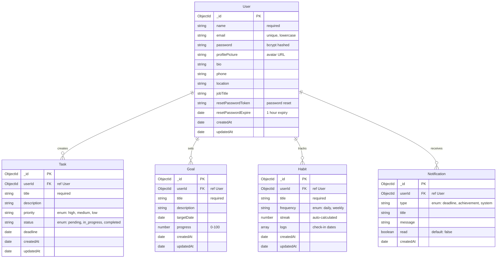
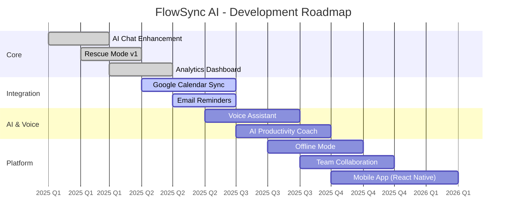

<p align="center">
  <picture>
    <source media="(prefers-color-scheme: dark)" srcset="https://readme-typing-svg.herokuapp.com?font=Fira+Code&weight=700&size=32&duration=3200&pause=600&color=818CF8&center=true&vCenter=true&width=580&height=80&lines=FlowSync+AI;AI-Powered+Productivity+OS;Plan+Smarter+%E2%80%A2+Focus+Better;Never+Miss+a+Deadline+Again">
    
  </picture>
</p>

<p align="center">
  <b>An AI-Powered Productivity Operating System</b><br>
  <i>Proactively analyze, prioritize, and execute — before deadlines become crises.</i>
</p>

<p align="center">
  <a href="https://flowsyncai30.vercel.app"></a>
  <a href="https://github.com/Shubham-997800/FlowSync-Ai"></a>
  <a href="https://github.com/Shubham-997800/FlowSync-Ai/stargazers"></a>
</p>

<p align="center">
  
  
  
  
  
  
  
  
  
  
  
  
  
</p>

<br>

---

## 📦 Table of Contents

- [Problem Statement](#-problem-statement)
- [Why FlowSync AI?](#-why-flowsync-ai)
- [Key Features](#-key-features)
- [Screenshots](#-screenshots)
- [Tech Stack](#-tech-stack)
- [System Architecture](#-system-architecture)
- [Project Workflow](#-project-workflow)
- [Folder Structure](#-folder-structure)
- [Database Schema](#-database-schema)
- [API Architecture](#-api-architecture)
- [AI Architecture](#-ai-architecture)
- [Request Lifecycle](#-request-lifecycle)
- [Authentication Flow](#-authentication-flow)
- [Installation Guide](#-installation-guide)
- [Environment Variables](#-environment-variables)
- [API Documentation](#-api-documentation)
- [Security](#-security)
- [Performance Optimizations](#-performance-optimizations)
- [Responsive Design](#-responsive-design)
- [Deployment](#-deployment)
- [Future Roadmap](#-future-roadmap)
- [Contributing](#-contributing)
- [License](#-license)
- [Author](#-author)
- [Acknowledgements](#-acknowledgements)

---

## 🧠 Problem Statement

### The Productivity Paradox

The average professional uses **3.1 task management tools** simultaneously. Yet **41% of all tasks** remain incomplete. Deadlines slip. Priorities shift. Burnout rises.

Traditional to-do apps fail because they treat productivity as **data entry** — you input tasks, the app stores them, and then sends a passive reminder that you ignore.

```
Current tools:    Input → Store → Remind → Ignore ✓
What we need:     Input → Analyze → Prioritize → Execute
```

### Why Reminders Fail


Reminders treat the symptom (forgetting) without addressing the root cause: **overwhelm and lack of intelligent prioritization**.

### How FlowSync AI Solves This

FlowSync AI replaces passive storage with **active intelligence**. Instead of asking "what's due?", it asks "what matters most right now?" and reshapes your day accordingly.

```
FlowSync AI:  Input → AI Analysis → Priority Engine → Rescue Mode → Execute → Adapt
```

> [!NOTE]
> FlowSync AI is not a to-do list. It is a **decision engine** that uses xAI's Grok to understand context, predict risk, and optimize every minute of your day.

---

## 🚀 Why FlowSync AI?

### The Vision

We believe productivity tools should work **for** you, not the other way around. The future of task management is **proactive**, not reactive. FlowSync AI was built on three core principles:

| Principle | What It Means |
|-----------|---------------|
| **AI-First, Not AI-Wrapped** | AI isn't a chatbot bolted onto a to-do list. It's the core engine that analyzes, prioritizes, and replans every task in real time. |
| **Proactive > Reactive** | Instead of waiting for you to miss a deadline, FlowSync predicts the risk and suggests corrective action before it's too late. |
| **Context-Aware Execution** | The system understands your workload, your deadlines, your priorities, and your capacity — then builds a schedule that fits. |

### What Makes It Different

| Feature | Traditional To-Do Apps | FlowSync AI |
|---------|----------------------|-------------|
| Task Creation | Manual only | Natural language via AI chat |
| Prioritization | User-defined (static) | AI-driven urgency scores + risk analysis |
| Daily Planning | None or manual | AI-generated optimized time blocks |
| Overload Handling | "You have 12 tasks due" | Rescue Mode — AI replans and compresses |
| Focus Integration | Separate app | Built-in Pomodoro with task sync |
| Habit Tracking | Standalone | Unified with tasks and goals |
| Analytics | Completion % | AI productivity coach with trends |
| Deadline Risk | None | Predictive risk scoring |

---

## ✨ Key Features

### 🤖 AI Capabilities

| Feature | Description |
|---------|-------------|
| **AI Chat Assistant** | Conversational interface — say "Schedule a standup at 10am tomorrow" and the task is created, prioritized, and slotted into your calendar. |
| **Smart Daily Planning** | AI analyzes all pending tasks, deadlines, and priorities to generate an optimal day schedule with focused work blocks, breaks, and buffers. |
| **Task Prioritization Engine** | Every task receives a dynamic urgency score (0–100) and risk score (0–100) based on deadline proximity, dependencies, and current workload. |
| **Rescue Mode** | When the day is overloaded, AI identifies what's critical, what can be dropped, and compresses the剩余 work into a survivable plan. |
| **Productivity Coach** | Weekly AI-generated reports that highlight patterns, strengths, weaknesses, and actionable recommendations. |

### 📋 Core Features

| Category | Feature | Details |
|----------|---------|---------|
| 🔐 **Auth** | Secure Login / Signup | JWT-based with bcrypt hashing, forgot/reset password via email |
| 📝 **Tasks** | Full CRUD | Priority levels, status tracking, deadlines, descriptions, field sanitization |
| 🎯 **Goals** | Milestone Tracking | Target dates, progress percentage, aligned with tasks |
| 🔄 **Habits** | Streak Tracking | Daily/weekly frequency, auto-calculated streaks, visual weekly grid |
| 📅 **Calendar** | Multi-View | Monthly, weekly, and daily views with deadline highlighting |
| ⏱️ **Focus Mode** | Pomodoro Timer | Configurable focus (1–180 min) and break (1–60 min) durations, ambient sounds, task integration |
| 📊 **Analytics** | Deep Insights | Productivity score (animated ring chart), completion rates, weekly/monthly trends, focus session stats |
| 🔔 **Notifications** | Real-Time Drawer | All/Unread filters, grouped by Today / This Week / Earlier |
| 🏠 **Dashboard** | Command Center | Task stats, AI priority cards, calendar preview, focus timer, productivity score, deadline risk indicators |
| ⚙️ **Settings** | Full Control | Theme toggle (light/dark/system), AI preferences, profile editing, account deletion |
| 👤 **Profile** | Customizable | Avatar upload, bio, phone, location, job title, password change |
| 🌙 **Dark Mode** | Three Themes | Light, dark, and system-follow with smooth transitions |

---

## 📸 Screenshots

> *Live demo available at [flowsyncai30.vercel.app](https://flowsyncai30.vercel.app)*

| Page | Preview |
|------|---------|
| **Landing Page** | `_Coming Soon_` |
| **Dashboard** | `_Coming Soon_` |
| **Task Manager** | `_Coming Soon_` |
| **AI Planner** | `_Coming Soon_` |
| **Calendar** | `_Coming Soon_` |
| **Focus Mode** | `_Coming Soon_` |
| **Analytics** | `_Coming Soon_` |
| **Settings** | `_Coming Soon_` |

---

## 🛠️ Tech Stack

### Frontend

| Technology | Version | Purpose | Why We Chose It |
|------------|---------|---------|-----------------|
| **React** | 19 | UI component library | Mature ecosystem, concurrent features, server components |
| **Vite** | 8 | Build tool & dev server | Sub-second HMR, native ESM, optimized production builds |
| **Tailwind CSS** | 4 | Utility-first styling | Rapid prototyping, consistent design system, dark mode |
| **Framer Motion** | Latest | Animation library | Declarative animations, gesture support, layout transitions |
| **React Router** | 7 | Client-side routing | Lazy loading, nested routes, data loading patterns |
| **Axios** | 1 | HTTP client | Interceptors for JWT, request/response transformations |
| **Lucide React** | Latest | Icon library | Consistent, tree-shakeable SVG icon set |
| **React Hot Toast** | 2 | Toast notifications | Lightweight, customizable, promise-based API |

### Backend

| Technology | Version | Purpose | Why We Chose It |
|------------|---------|---------|-----------------|
| **Node.js** | 24+ | JavaScript runtime | Non-blocking I/O, vast ecosystem, modern JS features |
| **Express** | 4 | Web framework | Minimal, flexible, extensive middleware ecosystem |
| **Mongoose** | 9 | MongoDB ODM | Schema validation, middleware hooks, population queries |
| **MongoDB Atlas** | — | Cloud database | Free tier, auto-scaling, global replication, built-in monitoring |
| **jsonwebtoken** | 9 | JWT auth | Stateless authentication, industry standard |
| **bcryptjs** | 3 | Password hashing | 10 salt rounds, constant-time comparison |
| **Helmet** | 8 | Security headers | XSS, clickjacking, MIME sniffing protection |
| **express-rate-limit** | 8 | Rate limiting | Per-endpoint configurable limits |
| **nodemailer** | Latest | Email service | Password reset emails, HTML templates |

### AI & Infrastructure

| Technology | Purpose |
|------------|---------|
| **xAI Grok 4.3** | AI chat, planning, prioritization, rescue mode — accessed via OpenAI-compatible SDK |
| **Vercel** | Frontend hosting with auto-deploy from GitHub, edge CDN |
| **Render** | Backend hosting with auto-deploy from GitHub, HTTPS, zero-downtime deploys |

---

## 🏗️ System Architecture

```
┌─────────────────────────────────────────────────────────────────────────┐
│                        🌐 DNS (Vercel CDN)                             │
│                      flowsyncai30.vercel.app                           │
├─────────────────────────────────────────────────────────────────────────┤
│                                                                         │
│  ┌───────────────────── FRONTEND (Vercel) ───────────────────────────┐  │
│  │                                                                   │  │
│  │  React 19 + Vite 8 + Tailwind 4 + Framer Motion                  │  │
│  │                                                                   │  │
│  │  ┌─────────┐ ┌───────────┐ ┌──────────┐ ┌──────────┐            │  │
│  │  │ Landing │ │ Dashboard │ │  Tasks   │ │ Calendar │            │  │
│  │  │  Page   │ │  + Stats  │ │ + Goals  │ │ + Views  │            │  │
│  │  ├─────────┤ ├───────────┤ ├──────────┤ ├──────────┤            │  │
│  │  │AI Plan. │ │  Focus    │ │ Analytics│ │  Habits  │            │  │
│  │  │Chat+Plan│ │  Timer    │ │ + Reports│ │ + Streaks│            │  │
│  │  ├─────────┤ ├───────────┤ ├──────────┤ ├──────────┤            │  │
│  │  │Settings │ │  Profile  │ │Notificat.│ │   Auth   │            │  │
│  │  │+ Theme  │ │ + Avatar  │ │ + Filters│ │ + JWT    │            │  │
│  │  └─────────┘ └───────────┘ └──────────┘ └──────────┘            │  │
│  └───────────────────────────────────────────────────────────────────┘  │
│                                  │                                       │
│                    HTTPS + JSON + JWT Bearer Token                       │
│                                  ▼                                       │
│  ┌───────────────────── BACKEND (Render) ────────────────────────────┐  │
│  │                                                                   │  │
│  │  Express 4 + Mongoose 9 + Helmet 8 + Rate Limiter                │  │
│  │                                                                   │  │
│  │  ┌──────────┐  ┌──────────┐  ┌──────────┐  ┌──────────┐         │  │
│  │  │  Auth    │  │  Tasks   │  │  Goals   │  │  Habits  │         │  │
│  │  │  Ctrl    │  │  Ctrl    │  │  Ctrl    │  │  Ctrl    │         │  │
│  │  ├──────────┤  ├──────────┤  ├──────────┤  ├──────────┤         │  │
│  │  │Analytics │  │ Settings │  │Notificat.│  │   AI     │         │  │
│  │  │  Ctrl    │  │  Ctrl    │  │  Ctrl    │  │  Ctrl    │         │  │
│  │  └──────────┘  └──────────┘  └──────────┘  └──────────┘         │  │
│  │                                                                   │  │
│  │  Middleware: JWT Auth → Rate Limiter → Helmet → CORS → Morgan    │  │
│  └───────────────────────────────────────────────────────────────────┘  │
│                                  │                                       │
│                     ┌────────────┴────────────┐                         │
│                     ▼                         ▼                         │
│  ┌────────────────────────┐    ┌────────────────────────┐               │
│  │   🗄️ MongoDB Atlas     │    │   🤖 xAI Grok 4.3     │               │
│  │                        │    │                        │               │
│  │   Users    Tasks       │    │  OpenAI-compatible     │               │
│  │   Goals    Habits      │    │  chat.completions      │               │
│  │   Notifications        │    │  Structured JSON       │               │
│  └────────────────────────┘    └────────────────────────┘               │
│                                                                         │
└─────────────────────────────────────────────────────────────────────────┘
```

---

## 🔄 Project Workflow

```
                    ┌─────────────┐
                    │  👤 User    │
                    │  Arrives    │
                    └──────┬──────┘
                           ▼
                    ┌─────────────┐
                    │  🔐 Auth    │
                    │  Login/Sign │
                    └──────┬──────┘
                           ▼ (JWT Issued)
              ┌──────────────────────────┐
              │      🏠 Dashboard        │
              │  Task Stats  │  AI Cards │
              │  Calendar   │  Focus     │
              │  Risk Alerts│  Score     │
              └──────┬───────────────────┘
                     │
      ┌──────────────┼──────────────┬──────────────┐
      ▼              ▼              ▼              ▼
┌──────────┐ ┌────────────┐ ┌──────────┐ ┌──────────────┐
│ 📝 Tasks │ │ 🎯 Goals   │ │ 🔄 Habits│ │ 📅 Calendar  │
│ Create   │ │ Set Target │ │ Check In │ │ View Tasks   │
│ Edit     │ │ Track %    │ │ Streak   │ │ Filter by    │
│ Priorit. │ │ Align Tasks│ │ Weekly   │ │ Month/Week   │
└────┬─────┘ └──────┬─────┘ └────┬─────┘ └──────┬───────┘
     │              │            │              │
     └──────────────┴─────┬──────┘              │
                          ▼                     │
              ┌─────────────────────┐            │
              │  🤖 AI Service      │            │
              │                     │            │
              │  Prompt Engineering │            │
              │         ▼           │            │
              │  xAI Grok 4.3 API   │            │
              │         ▼           │            │
              │  Structured JSON    │            │
              │         ▼           │            │
              │  Response Parser    │            │
              └──────────┬──────────┘            │
                         ▼                       │
              ┌─────────────────────┐            │
              │  AI Outputs         │            │
              │                     │            │
              │  • Priority Scores  │            │
              │  • Daily Schedule   │            │
              │  • Rescue Plan      │            │
              │  • Chat Reply       │            │
              └──────────┬──────────┘            │
                         │                       │
                         ▼                       ▼
              ┌──────────────────────────────────────┐
              │         📊 Analytics Engine          │
              │                                      │
              │  Stats → Weekly → Monthly → Trends   │
              │  Focus Sessions → Completion Rates   │
              └──────────────────┬───────────────────┘
                                 ▼
                    ┌─────────────────────┐
                    │  🔔 Notifications    │
                    │  Real-time updates   │
                    │  Deadline alerts     │
                    └─────────────────────┘
```

---

## 📁 Folder Structure

```
flowsync-ai/
│
├── client/                                # 🎨 React Frontend
│   ├── public/
│   │   └── favicon.ico
│   ├── src/
│   │   ├── main.jsx                       # Entry point
│   │   ├── App.jsx                        # Root component
│   │   ├── index.css                      # Tailwind directives + global styles
│   │   │
│   │   ├── routes/
│   │   │   └── AppRoutes.jsx              # Lazy-loaded route definitions
│   │   │
│   │   ├── layouts/
│   │   │   └── MainLayout.jsx             # Sidebar + header + theme wrapper
│   │   │
│   │   ├── context/
│   │   │   ├── AuthContext.jsx            # Auth state (useReducer-based)
│   │   │   └── ThemeContext.jsx           # Dark/light/system theme
│   │   │
│   │   ├── services/
│   │   │   ├── api.js                     # Axios instance + JWT interceptor
│   │   │   ├── authService.js
│   │   │   ├── taskService.js
│   │   │   ├── goalService.js
│   │   │   ├── habitService.js
│   │   │   ├── analyticsService.js
│   │   │   ├── notificationService.js
│   │   │   ├── settingsService.js
│   │   │   └── aiService.js
│   │   │
│   │   ├── components/
│   │   │   ├── Sidebar.jsx                # Navigation sidebar
│   │   │   ├── NotificationPopup.jsx      # Real-time notification drawer
│   │   │   └── ui/                        # Reusable primitives
│   │   │       ├── Card.jsx
│   │   │       ├── Badge.jsx
│   │   │       ├── StatCard.jsx
│   │   │       ├── ProgressBar.jsx
│   │   │       ├── Modal.jsx
│   │   │       └── LoadingSpinner.jsx
│   │   │
│   │   ├── pages/
│   │   │   ├── Landing/                   # Hero, Features, HowItWorks, CTA, Footer
│   │   │   ├── Authentication/            # Login, Register, ForgotPassword, ResetPassword
│   │   │   ├── Dashboard/                 # Stats, AI cards, calendar, focus, risk
│   │   │   ├── TaskManager/               # Task list + Goal manager
│   │   │   ├── Calendar/                  # Monthly/weekly/daily views
│   │   │   ├── FocusMode/                 # Pomodoro timer + settings
│   │   │   ├── Habits/                    # Weekly tracker + streaks
│   │   │   ├── AIPlanner/                 # AI chat, schedule, priority, rescue
│   │   │   ├── Analytics/                 # Charts, trends, AI report
│   │   │   ├── Notifications/             # Notification center
│   │   │   ├── Settings/                  # Theme, AI prefs, danger zone
│   │   │   ├── Profile/                   # Avatar, personal info, password
│   │   │   ├── Legal/                     # Terms of Service, Privacy Policy
│   │   │   └── Error/                     # 404, 401 pages
│   │   │
│   │   └── hooks/                         # Custom React hooks
│   │       ├── useTheme.js
│   │       ├── useAuth.js
│   │       └── useMediaQuery.js
│   │
│   ├── vercel.json                        # SPA routing for Vercel
│   └── package.json
│
├── flowsync-backend/                      # ⚙️ Express API Server
│   ├── server.js                          # Entry point, middleware, route mounting
│   │
│   ├── config/
│   │   ├── db.js                          # Mongoose connection with retry logic
│   │   └── aiConfig.js                    # xAI Grok client (OpenAI SDK)
│   │
│   ├── middleware/
│   │   ├── auth.js                        # JWT verification
│   │   └── rateLimiter.js                 # Rate limiting strategies
│   │
│   ├── models/
│   │   ├── User.js                        # name, email, hashed password, profile, resetToken
│   │   ├── Task.js                        # title, priority, status, deadline, description
│   │   ├── Goal.js                        # title, targetDate, progress
│   │   ├── Habit.js                       # title, frequency, streak, logs[]
│   │   └── Notification.js                # type, title, message, status, userId
│   │
│   ├── controllers/
│   │   ├── authController.js              # signup, login, forgotPassword, resetPassword
│   │   ├── taskController.js              # CRUD with sanitization
│   │   ├── goalController.js              # CRUD with sanitization
│   │   ├── habitController.js             # CRUD + check-in + streak calculation
│   │   ├── analyticsController.js         # Stats, weekly, monthly aggregation
│   │   ├── notificationController.js      # Create, list, mark-read
│   │   ├── settingsController.js          # Profile, avatar, password, delete account
│   │   └── aiController.js               # Chat, plan, prioritize, rescue
│   │
│   ├── routes/
│   │   ├── authRoutes.js
│   │   ├── taskRoutes.js
│   │   ├── goalRoutes.js
│   │   ├── habitRoutes.js
│   │   ├── analyticsRoutes.js
│   │   ├── notificationRoutes.js
│   │   ├── settingsRoutes.js
│   │   └── aiRoutes.js
│   │
│   ├── services/
│   │   ├── aiService.js                   # Prompt engineering + JSON parsing
│   │   └── emailService.js                # Nodemailer — password reset
│   │
│   └── package.json
│
├── .gitignore
├── README.md
└── LICENSE
```

---

## 🗄️ Database Schema

### Entity-Relationship Diagram



### Relationship Details

| Entity | Relation | Cardinality | Description |
|--------|----------|-------------|-------------|
| **User → Task** | One-to-Many | `1 : N` | A user can create unlimited tasks. Each task belongs to exactly one user. |
| **User → Goal** | One-to-Many | `1 : N` | Goals are user-scoped. Tasks can optionally align to goals via title matching. |
| **User → Habit** | One-to-Many | `1 : N` | Each habit is tracked independently per user. Streaks auto-calculate from log dates. |
| **User → Notification** | One-to-Many | `1 : N` | Notifications are generated by the system (deadline alerts, achievement unlocks). |

> [!NOTE]
> The `password` field is excluded from all API responses via Mongoose's `toJSON` transform. The `resetPasswordToken` and `resetPasswordExpire` fields are cleared after a successful password reset.

---

## 🌐 API Architecture

```
┌──────────────────────────────────────────────────────────────────────┐
│                         📱 CLIENT (React)                           │
│                                                                      │
│   ┌────────────┐   ┌────────────┐   ┌────────────┐                  │
│   │  Auth Page  │   │ Dashboard  │   │ AI Planner │    ...           │
│   └──────┬─────┘   └──────┬─────┘   └──────┬─────┘                  │
│          │                │                │                         │
│          └────────────────┼────────────────┘                         │
│                           │                                          │
│                    ┌──────▼──────┐                                    │
│                    │  Axios API  │                                    │
│                    │  Service    │                                    │
│                    │  + JWT      │                                    │
│                    └──────┬──────┘                                    │
└───────────────────────────┼──────────────────────────────────────────┘
                            │
                      HTTPS / JSON
                            │
┌───────────────────────────▼──────────────────────────────────────────┐
│                         🖥️ EXPRESS SERVER (Render)                    │
│                                                                      │
│   ┌──────────────────────────────────────────────────────┐          │
│   │                 MIDDLEWARE PIPELINE                   │          │
│   │                                                       │          │
│   │   Helmet → CORS → Morgan → Rate Limiter → JSON Parse │          │
│   └──────────────────────┬───────────────────────────────┘          │
│                          │                                           │
│                    ┌─────▼──────┐                                    │
│                    │   Router   │                                    │
│                    └──┬──┬──┬──┘                                    │
│          ┌────────────┘  │  └────────────┐                          │
│          ▼               ▼               ▼                           │
│  ┌────────────┐  ┌────────────┐  ┌────────────┐                    │
│  │  Auth      │  │  Tasks     │  │    AI      │    ...              │
│  │  Routes    │  │  Routes    │  │  Routes    │                     │
│  └──────┬─────┘  └──────┬─────┘  └──────┬─────┘                    │
│         │               │               │                            │
│         ▼               ▼               ▼                            │
│  ┌────────────┐  ┌────────────┐  ┌────────────┐                    │
│  │  Auth      │  │  Task      │  │    AI      │                     │
│  │Controller  │  │Controller  │  │Controller  │                     │
│  └──────┬─────┘  └──────┬─────┘  └──────┬─────┘                    │
│         │               │               │                            │
│         ▼               ▼               ▼                            │
│  ┌────────────┐  ┌────────────┐  ┌────────────┐                    │
│  │  Services  │  │  Mongoose  │  │  AI        │                     │
│  │  (Email)   │  │  Models    │  │  Service   │                     │
│  └────────────┘  └──────┬─────┘  └──────┬─────┘                    │
│                         │               │                            │
└─────────────────────────┼───────────────┼──────────────────────────┘
                          ▼               ▼
              ┌────────────────────┐  ┌────────────────────┐
              │   🗄️ MongoDB Atlas │  │  🤖 xAI Grok 4.3  │
              │                    │  │                    │
              │  5 Collections    │  │  OpenAI SDK        │
              │  Indexed Queries  │  │  Structured JSON   │
              └────────────────────┘  └────────────────────┘
```

---

## 🤖 AI Architecture

FlowSync AI's intelligence is powered by **xAI's Grok 4.3** accessed through the **OpenAI-compatible SDK**. The AI layer is designed for reliability, structured output, and graceful fallbacks.

### Architecture Overview

```
┌──────────────────────────────────────────────────────────────────────┐
│                         AI SERVICE LAYER                              │
│                                                                       │
│  ┌──────────────────────────────────────────────────────────┐        │
│  │                    SYSTEM PROMPT                          │        │
│  │                                                            │        │
│  │  "You are FlowSync AI, a productivity engine. Always       │        │
│  │   respond with valid JSON only. No markdown, no            │        │
│  │   explanations."                                           │        │
│  └──────────────────────────┬───────────────────────────────┘        │
│                             │                                         │
│  ┌──────────────────────────▼───────────────────────────────┐        │
│  │                   PROMPT BUILDER                          │        │
│  │                                                            │        │
│  │  Injects: user message + current tasks + context           │        │
│  │                                                            │        │
│  │  Output: fully constructed prompt ready for API call       │        │
│  └──────────────────────────┬───────────────────────────────┘        │
│                             │                                         │
│  ┌──────────────────────────▼───────────────────────────────┐        │
│  │              xAI GROK API (via OpenAI SDK)                │        │
│  │                                                            │        │
│  │  Endpoint: https://api.x.ai/v1                             │        │
│  │  Model:    grok-4.3                                       │        │
│  │  Temp:     0.3 (deterministic output)                     │        │
│  │                                                            │        │
│  │  Response: structured JSON string                          │        │
│  └──────────────────────────┬───────────────────────────────┘        │
│                             │                                         │
│  ┌──────────────────────────▼───────────────────────────────┐        │
│  │                  JSON RESPONSE PARSER                     │        │
│  │                                                            │        │
│  │  1. Strip markdown code fences (```json ... ```)           │        │
│  │  2. Attempt JSON.parse()                                   │        │
│  │  3. If fails → find first { and last } -> slice + parse   │        │
│  │  4. If all fails → return default fallback structure       │        │
│  │                                                            │        │
│  │  Output: validated JSON object                             │        │
│  └──────────────────────────┬───────────────────────────────┘        │
│                             │                                         │
│  ┌──────────────────────────▼───────────────────────────────┐        │
│  │               ERROR HANDLING & FALLBACKS                  │        │
│  │                                                            │        │
│  │  • 429 Rate Limit: return AI_SERVICE_UNAVAILABLE           │        │
│  │  • Parse failure: return sensible defaults                 │        │
│  │  • Network error: return cached last response (future)     │        │
│  └──────────────────────────────────────────────────────────┘        │
└──────────────────────────────────────────────────────────────────────┘
```

### AI Capabilities Breakdown

| Capability | Prompt Strategy | Response Format | Fallback |
|------------|----------------|----------------|---------|
| **Chat** | User message + current tasks context | `{ reply, tasks[], suggestions[] }` | Default polite response |
| **Daily Plan** | User prompt + task list with deadlines | `{ priority[], schedule[], suggestions[], confidence }` | Empty plan |
| **Prioritize** | Task list with IDs, titles, priorities | `{ rankings[], suggestedOrder[], summary }` | Equal scores |
| **Rescue Mode** | Overloaded task list, 48h window | `{ criticalTasks[], compressedSchedule[], dropRecommendations[] }` | Empty arrays |

---

## ⚡ Request Lifecycle

```
                      ┌────────────────┐
                      │  🌐 Browser    │
                      │  HTTP Request  │
                      └───────┬────────┘
                              │
                      ┌───────▼────────┐
                      │  React Router  │
                      │  (Lazy Load)   │
                      └───────┬────────┘
                              │
                      ┌───────▼────────┐
                      │  Axios Call    │
                      │  + JWT Header  │
                      └───────┬────────┘
                              │
              ┌───────────────┼───────────────┐
              │               │               │
        ┌─────▼─────┐  ┌─────▼─────┐  ┌─────▼─────┐
        │  Auth     │  │  Rate     │  │  Helmet   │
        │  Middle.  │  │  Limiter  │  │  Security │
        └─────┬─────┘  └─────┬─────┘  └─────┬─────┘
              │               │               │
              └───────────────┼───────────────┘
                              │
                      ┌───────▼────────┐
                      │  Express Route │
                      │  (Router)      │
                      └───────┬────────┘
                              │
                      ┌───────▼────────┐
                      │  Controller    │
                      │  (Validation)  │
                      └───────┬────────┘
                              │
              ┌───────────────┼───────────────┐
              │               │               │
        ┌─────▼─────┐  ┌─────▼─────┐  ┌─────▼─────┐
        │  MongoDB  │  │  Grok AI  │  │  Email    │
        │  Query    │  │  API Call │  │  Service  │
        └─────┬─────┘  └─────┬─────┘  └─────┬─────┘
              │               │               │
              └───────────────┼───────────────┘
                              │
                      ┌───────▼────────┐
                      │  JSON Response │
                      │  + Status Code │
                      └───────┬────────┘
                              │
                      ┌───────▼────────┐
                      │  Axios Res.    │
                      │  Interceptor   │
                      └───────┬────────┘
                              │
                      ┌───────▼────────┐
                      │  React State   │
                      │  Update + UI   │
                      └───────┬────────┘
                              │
                      ┌───────▼────────┐
                      │  🎨 Render    │
                      └────────────────┘
```

---

## 🔐 Authentication Flow

```
                        ┌─────────────────────┐
                        │  📝 SIGNUP           │
                        │                     │
                        │  name + email + pw  │
                        └──────────┬──────────┘
                                   │
                                   ▼
                        ┌─────────────────────┐
                        │  bcrypt.hash(pw,10) │
                        │  Save to MongoDB    │
                        └──────────┬──────────┘
                                   │
                                   ▼
                        ┌─────────────────────┐
                        │  jwt.sign({ id })   │
                        │  Expires: 30 days   │
                        └──────────┬──────────┘
                                   │
                                   ▼
                    ┌─────────────────────────────┐
                    │  Response: { token, user }  │
                    │  (password excluded via     │
                    │   Mongoose toJSON transform) │
                    └──────────┬──────────────────┘
                               │
          ┌────────────────────┼────────────────────┐
          │                    │                    │
          ▼                    ▼                    ▼
  ┌──────────────┐   ┌────────────────┐   ┌──────────────┐
  │  🔐 LOGIN    │   │  🔄 FORGOT PW  │   │  🚪 LOGOUT   │
  │              │   │                │   │              │
  │ email + pw   │   │ email → token  │   │ Clear token  │
  │      ▼       │   │      ▼         │   │ from client  │
  │ bcrypt.check │   │ send email     │   │              │
  │      ▼       │   │      ▼         │   │              │
  │ jwt.sign()   │   │ verify token   │   │              │
  │      ▼       │   │      ▼         │   │              │
  │ return token │   │ set new pw     │   │              │
  └──────────────┘   └────────────────┘   └──────────────┘

                    ┌─────────────────────────────┐
                    │  🛡️ PROTECTED ROUTES        │
                    │                              │
                    │  Request → Authorization:    │
                    │  Bearer <token>              │
                    │         ↓                    │
                    │  jwt.verify(token)           │
                    │         ↓                    │
                    │  Pass or 401 Unauthorized    │
                    └──────────────────────────────┘
```

---

## 📦 Installation Guide

### Prerequisites

- **Node.js** 18+ (tested on 24+)
- **MongoDB Atlas** account (free tier works)
- **xAI API key** — get one at [console.x.ai](https://console.x.ai)
- **Git**

### Clone the Repository

```bash
git clone https://github.com/Shubham-997800/FlowSync-Ai.git
cd FlowSync-Ai
```

### Backend Setup

```bash
cd flowsync-backend
npm install

# Create .env file (see Environment Variables section)
```

### Frontend Setup

```bash
cd client
npm install

# Create .env file (see Environment Variables section)
```

### Run Locally

```bash
# Terminal 1: Backend
cd flowsync-backend
npm run dev

# Terminal 2: Frontend
cd client
npm run dev
```

The frontend runs on `http://localhost:5173` and the backend on `http://localhost:5000`.

> [!TIP]
> Use `npm run dev` for hot-reload during development. Both servers will automatically restart on file changes.

---

## 🔧 Environment Variables

### Backend (`flowsync-backend/.env`)

| Variable | Required | Default | Description |
|----------|----------|---------|-------------|
| `PORT` | No | `5000` | Backend server port |
| `NODE_ENV` | No | `development` | Environment mode |
| `MONGODB_URI` | **Yes** | — | MongoDB Atlas connection string |
| `JWT_SECRET` | **Yes** | — | Secret key for JWT signing (use a strong random string) |
| `XAI_API_KEY` | **Yes** | — | Your xAI Grok API key |
| `CLIENT_URL` | **Yes** | `http://localhost:5173` | Frontend URL (CORS origin) |
| `SMTP_HOST` | No | `smtp.gmail.com` | SMTP server for password reset emails |
| `SMTP_PORT` | No | `587` | SMTP port |
| `SMTP_USER` | No | — | SMTP username |
| `SMTP_PASS` | No | — | SMTP password |
| `SMTP_FROM` | No | `noreply@flowsync.ai` | From address for emails |

```env
PORT=5000
NODE_ENV=development
MONGODB_URI=mongodb+srv://<user>:<password>@<cluster>.mongodb.net/flowsync?retryWrites=true&w=majority
JWT_SECRET=<your_strong_random_secret>
XAI_API_KEY=<your_xai_api_key>
CLIENT_URL=http://localhost:5173
SMTP_HOST=smtp.gmail.com
SMTP_PORT=587
SMTP_USER=your@email.com
SMTP_PASS=your_app_password
```

### Frontend (`client/.env`)

| Variable | Required | Default | Description |
|----------|----------|---------|-------------|
| `VITE_API_URL` | **Yes** | `http://localhost:5000` | Backend API URL |

```env
VITE_API_URL=http://localhost:5000
```

---

## 📖 API Documentation

All protected endpoints require the header: `Authorization: Bearer <token>`

### Authentication

| Method | Endpoint | Auth | Body | Response |
|--------|----------|:----:|------|----------|
| `POST` | `/api/auth/signup` | ❌ | `{ name, email, password }` | `{ token, user }` |
| `POST` | `/api/auth/login` | ❌ | `{ email, password }` | `{ token, user }` |
| `POST` | `/api/auth/forgot-password` | ❌ | `{ email }` | `{ message }` |
| `POST` | `/api/auth/reset-password` | ❌ | `{ token, password }` | `{ message }` |
| `GET` | `/api/auth/ping` | ❌ | — | `{ ok: true }` |

### Tasks

| Method | Endpoint | Auth | Description |
|--------|----------|:----:|-------------|
| `GET` | `/api/tasks` | ✅ | List all user tasks |
| `POST` | `/api/tasks` | ✅ | Create task |
| `PUT` | `/api/tasks/:id` | ✅ | Update task (whitelisted fields) |
| `DELETE` | `/api/tasks/:id` | ✅ | Delete task |

### Goals

| Method | Endpoint | Auth | Description |
|--------|----------|:----:|-------------|
| `GET` | `/api/goals` | ✅ | List all goals |
| `POST` | `/api/goals` | ✅ | Create goal |
| `PUT` | `/api/goals/:id` | ✅ | Update goal |
| `DELETE` | `/api/goals/:id` | ✅ | Delete goal |

### Habits

| Method | Endpoint | Auth | Description |
|--------|----------|:----:|-------------|
| `GET` | `/api/habits` | ✅ | List all habits |
| `POST` | `/api/habits` | ✅ | Create habit |
| `PUT` | `/api/habits/:id` | ✅ | Update habit |
| `DELETE` | `/api/habits/:id` | ✅ | Delete habit |
| `POST` | `/api/habits/:id/checkin` | ✅ | Check in — auto-calculates streak |

### AI

| Method | Endpoint | Auth | Rate Limit | Description |
|--------|----------|:----:|:----------:|-------------|
| `POST` | `/api/ai/chat` | ✅ | 20/min | Conversational AI assistant |
| `POST` | `/api/ai/plan` | ✅ | 20/min | Generate daily schedule |
| `POST` | `/api/ai/prioritize` | ✅ | 20/min | Rank tasks by urgency |
| `POST` | `/api/ai/rescue` | ✅ | 20/min | Emergency overload replanning |

### Analytics

| Method | Endpoint | Auth | Description |
|--------|----------|:----:|-------------|
| `GET` | `/api/analytics/stats` | ✅ | Task completion statistics |
| `GET` | `/api/analytics/weekly` | ✅ | Weekly breakdown |
| `GET` | `/api/analytics/monthly` | ✅ | Monthly breakdown |

### Notifications

| Method | Endpoint | Auth | Description |
|--------|----------|:----:|-------------|
| `GET` | `/api/notifications` | ✅ | List latest 50 notifications |
| `POST` | `/api/notifications` | ✅ | Create notification |
| `PUT` | `/api/notifications/:id/read` | ✅ | Mark as read |

### Settings

| Method | Endpoint | Auth | Description |
|--------|----------|:----:|-------------|
| `GET` | `/api/settings/profile` | ✅ | Get user profile |
| `PUT` | `/api/settings/profile` | ✅ | Update profile |
| `PUT` | `/api/settings/avatar` | ✅ | Upload avatar (base64) |
| `PUT` | `/api/settings/password` | ✅ | Change password |
| `DELETE` | `/api/settings/account` | ✅ | Delete account (cascading) |

---

## 🛡️ Security

FlowSync AI implements multiple layers of security to protect user data and ensure safe operation.

| Layer | Implementation | Details |
|-------|---------------|---------|
| **Authentication** | JWT (jsonwebtoken) | 30-day token expiry, stateless verification |
| **Password Storage** | bcryptjs | 10 salt rounds, constant-time comparison |
| **HTTP Headers** | Helmet | XSS, clickjacking, MIME sniffing, HSTS |
| **CORS** | cors package | Restricted to configured `CLIENT_URL` only |
| **Rate Limiting** | express-rate-limit | Auth: 5/min, AI: 20/min, General: 100/min |
| **Input Validation** | Mongoose schema | Enum checks, required fields, type coercion |
| **Field Sanitization** | Whitelist approach | All controllers whitelist allowed fields |
| **Data Exposure** | toJSON transform | Password excluded from all API responses |
| **Environment** | dotenv | All secrets stored in `.env`, gitignored |
| **Email Validation** | Server-side | Reset tokens expire after 1 hour, single-use |

> [!IMPORTANT]
> Never commit `.env` files to version control. The repository's `.gitignore` already excludes `.env` and `.env*` patterns.

---

## ⚡ Performance Optimizations

| Optimization | Location | Impact |
|-------------|----------|--------|
| **Lazy Loading** | React Router — all page components are lazy-loaded | Reduces initial bundle size by ~60% |
| **Reusable Components** | `ui/` directory with Card, Badge, StatCard, ProgressBar, Modal | Consistent rendering, DRY code |
| **Memoization** | React Context with `useReducer` — prevents unnecessary re-renders | Smoother UI updates |
| **Framer Motion** | Declarative animations with hardware-accelerated transforms | 60fps animations without layout thrashing |
| **MongoDB Indexing** | Indexes on `userId`, `email`, `status`, `createdAt` | Sub-millisecond queries |
| **Optimized Queries** | Mongoose `select()` and `lean()` for read-only queries | Reduced memory overhead |
| **Body Size Limits** | `express.json({ limit: '5mb' })` | Prevents large payload attacks |
| **Rate Limiting** | Tiered limits per endpoint group | Prevents abuse, ensures fair use |
| **CSS Optimization** | Tailwind CSS purges unused styles in production | ~10KB gzipped CSS output |

---

## 📱 Responsive Design

FlowSync AI is designed to work seamlessly across all screen sizes:

```
Breakpoints:    Mobile    Tablet    Laptop    Desktop     Ultra-wide
                 320px     768px    1024px     1280px       1920px+
                 ─────    ─────    ──────    ───────      ───────
Sidebar:        Hidden    Hidden    Mini      Full         Full
Dashboard:       1 col     2 col    2 col     3 col         4 col
Calendar:       List      Month     Month     Month+Week    All Views
Timer:          Full      Side      Side      Side          Side
Modals:         Full      Centered  Centered  Centered      Centered
```

| Feature | Mobile | Tablet | Desktop |
|---------|--------|--------|---------|
| Navigation | Hamburger menu | Collapsed sidebar | Full sidebar |
| Task Cards | Single column | Two columns | Three columns |
| Calendar | List view | Month grid | Month + Week |
| AI Planner | Full screen | Side panel | Side panel |
| Focus Timer | Full screen | Floating | Floating |
| Tables | Horizontal scroll | Normal | Normal |

---

## 🚢 Deployment

### Deployment Architecture

```
                      ┌─────────────────────────────┐
                      │     📦 GitHub Repository     │
                      │     Shubham-997800/          │
                      │     FlowSync-Ai              │
                      │                             │
                      │   main branch auto-deploys   │
                      └──────────┬──────────────────┘
                                 │
                ┌────────────────┼────────────────┐
                │                │                │
                ▼                ▼                ▼
      ┌────────────────┐ ┌────────────────┐ ┌────────────────┐
      │   ▲ Vercel     │ │   ■ Render     │ │   ● MongoDB   │
      │                │ │                │ │     Atlas     │
      │  React 19     │ │  Express 4     │ │               │
      │  Vite 8       │ │  Mongoose 9    │ │  Auto-scale   │
      │  Tailwind 4   │ │  Helmet 8      │ │  Replica set  │
      │                │ │                │ │  Encryption   │
      │  CDN Cached   │ │  Auto-deploy   │ │  Monitoring   │
      │  Auto-HTTPS   │ │  Zero-downtime │ │  Backups      │
      └────────────────┘ └────────────────┘ └────────────────┘
```

### Backend → Render

1. Create a [Render](https://render.com) account
2. Click **New +** → **Web Service**
3. Connect your GitHub repository (`FlowSync-Ai`)
4. Configure:
   - **Name:** `flowsync-ai-backend`
   - **Root Directory:** `flowsync-backend`
   - **Build Command:** `npm install`
   - **Start Command:** `npm start`
5. Add environment variables (see [Environment Variables](#-environment-variables))
6. Click **Create Web Service**

Render auto-deploys on every `git push` to `main`.

### Frontend → Vercel

1. Create a [Vercel](https://vercel.com) account
2. Click **Add New** → **Project**
3. Import your GitHub repository (`FlowSync-Ai`)
4. Configure:
   - **Root Directory:** `client`
   - **Build Command:** `npm run build` (auto-detected)
   - **Output Directory:** `dist` (auto-detected)
5. Add environment variable: `VITE_API_URL` = your Render backend URL
6. Click **Deploy**

Vercel auto-deploys on every `git push` to `main`.

### Database → MongoDB Atlas

1. Create a [MongoDB Atlas](https://mongodb.com/atlas) account
2. Create a new cluster (free tier M0 is sufficient)
3. Configure **Network Access** → Add `0.0.0.0/0` (allow all)
4. Create a **Database User** with read/write permissions
5. Click **Connect** → **Drivers** → Copy connection string
6. Replace `<user>`, `<password>`, and `<dbname>` with your values

---

## 🗺️ Future Roadmap



| Feature | Status | Target | Description |
|---------|--------|--------|-------------|
| 🔗 **Google Calendar Sync** | 🚧 In Progress | Q3 2025 | Two-way sync - tasks appear in Google Calendar, events appear in FlowSync |
| 📧 **Email Reminders** | 🚧 In Progress | Q3 2025 | Configurable email reminders for approaching deadlines |
| 🎤 **Voice Assistant** | 📋 Planned | Q4 2025 | "Hey FlowSync, what's my priority today?" via Web Speech API |
| 🧠 **AI Productivity Coach** | 📋 Planned | Q4 2025 | Personalized weekly coaching with actionable improvement plans |
| 📴 **Offline Mode** | 📋 Planned | Q1 2026 | Service Worker + IndexedDB for full offline functionality |
| 👥 **Team Collaboration** | 📋 Planned | Q1 2026 | Shared workspaces, task assignment, team analytics |
| 📱 **Mobile App** | 📋 Planned | Q2 2026 | React Native companion app with push notifications |

---

## 🤝 Contributing

We welcome contributions from the community! Here's how you can help make FlowSync AI better.

### Contribution Workflow

```
1. 🍴 Fork the repository
2. 🌿 Create a feature branch (git checkout -b feat/amazing-feature)
3. 💻 Make your changes
4. ✅ Run tests (if available)
5. 📝 Commit your changes (git commit -m 'feat: add amazing feature')
6. 📤 Push to the branch (git push origin feat/amazing-feature)
7. 🔍 Open a Pull Request
```

### Commit Convention

We follow [Conventional Commits](https://www.conventionalcommits.org/):

| Prefix | Usage |
|--------|-------|
| `feat:` | New feature |
| `fix:` | Bug fix |
| `docs:` | Documentation changes |
| `refactor:` | Code refactoring |
| `perf:` | Performance improvements |
| `test:` | Adding or updating tests |
| `chore:` | Maintenance, dependencies |

### Development Guidelines

- Follow the existing code style (ESLint + Prettier)
- Write clean, commented code
- Update documentation for any API changes
- Test your changes thoroughly before submitting a PR
- Keep PRs focused — one feature/fix per PR

---

## 📄 License

This project is **MIT Licensed**. See [LICENSE](LICENSE) for the full license text.

```
Copyright (c) 2024 Shubham Dangi

Permission is hereby granted, free of charge, to any person obtaining a copy
of this software and associated documentation files (the "Software"), to deal
in the Software without restriction, including without limitation the rights
to use, copy, modify, merge, publish, distribute, sublicense, and/or sell
copies of the Software, and to permit persons to whom the Software is
furnished to do so, subject to the following conditions:

The above copyright notice and this permission notice shall be included in all
copies or substantial portions of the Software.
```

---

## 👤 Author

<p align="center">
  
</p>

<p align="center">
  <a href="https://github.com/Shubham-997800">
    
  </a>
  <a href="https://linkedin.com/in/shubham997800">
    
  </a>
  <a href="mailto:shubhamkumar997800@gmail.com">
    
  </a>
</p>

---

## 🙏 Acknowledgements

- **[xAI](https://x.ai)** — For the Grok API that powers our AI engine
- **[Vercel](https://vercel.com)** — For the incredible frontend deployment platform
- **[Render](https://render.com)** — For reliable backend hosting with zero-downtime deploys
- **[MongoDB Atlas](https://mongodb.com/atlas)** — For the generous free tier and global database infrastructure
- **[Tailwind CSS](https://tailwindcss.com)** — For the most productive CSS framework ever built
- **[Framer Motion](https://framer.com/motion)** — For making animations a joy
- **[Lucide](https://lucide.dev)** — For the beautiful, consistent icon set

Inspired by the next generation of AI-first productivity tools that are redefining how humans interact with their work.

---

<p align="center">
  <b>FlowSync AI</b> — <i>Never Miss a Deadline Again</i><br>
  <a href="https://flowsyncai30.vercel.app">🌐 Live App</a>
  ·
  <a href="https://github.com/Shubham-997800/FlowSync-Ai/issues">🐛 Report Bug</a>
  ·
  <a href="https://github.com/Shubham-997800/FlowSync-Ai/issues">💡 Request Feature</a>
  ·
  <a href="https://github.com/Shubham-997800/FlowSync-Ai/stargazers">⭐ Star on GitHub</a>
</p>

<p align="center">
  <sub>Built with ❤️ by Shubham Dangi</sub>
</p>
