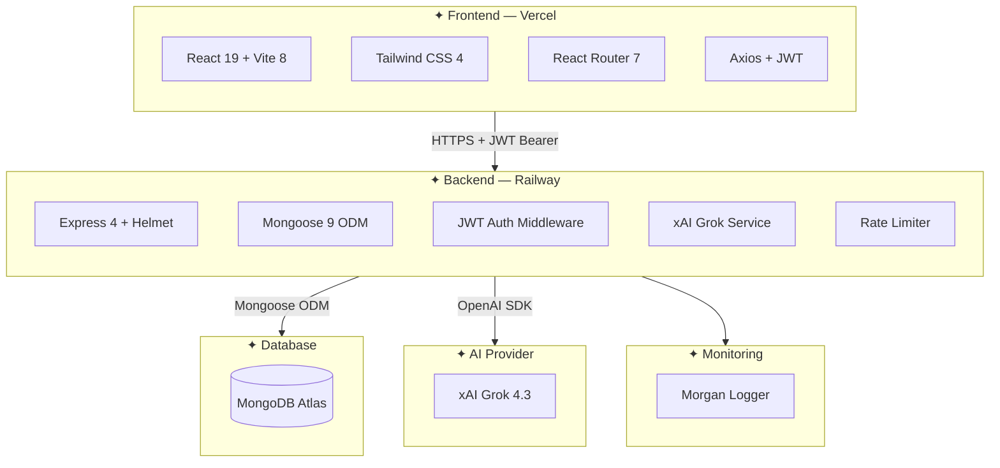
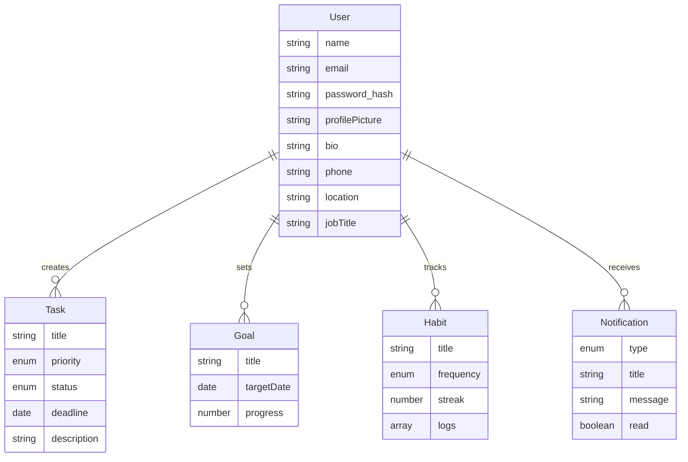
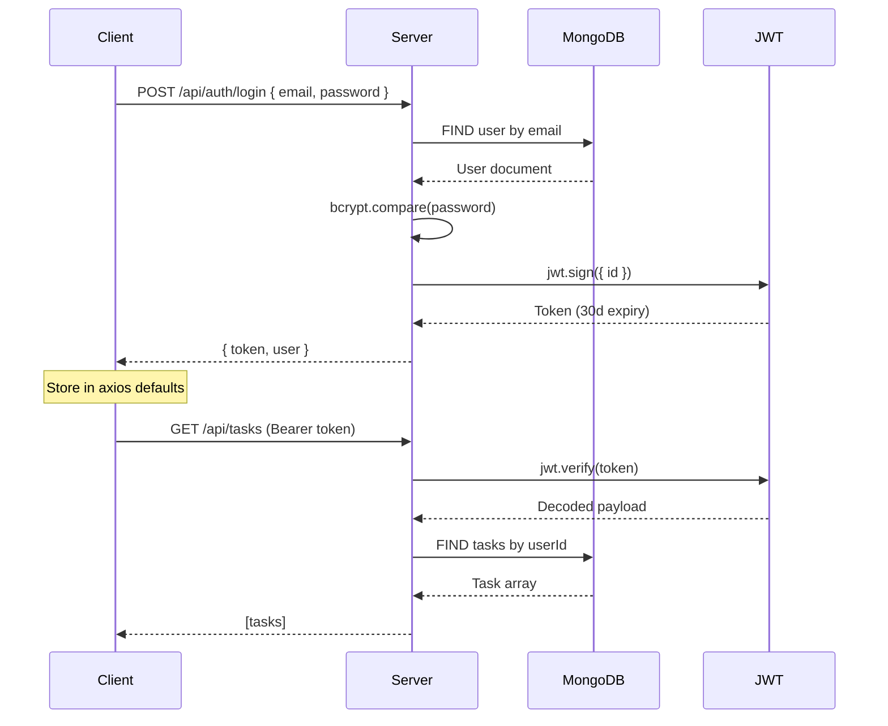
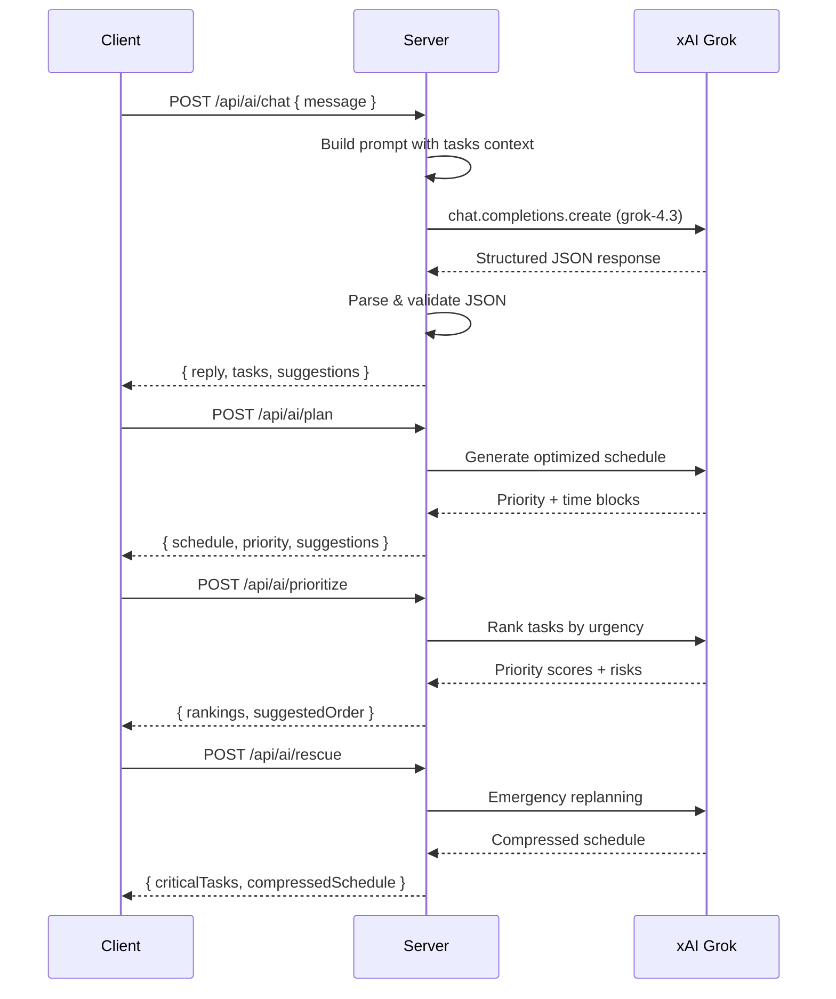
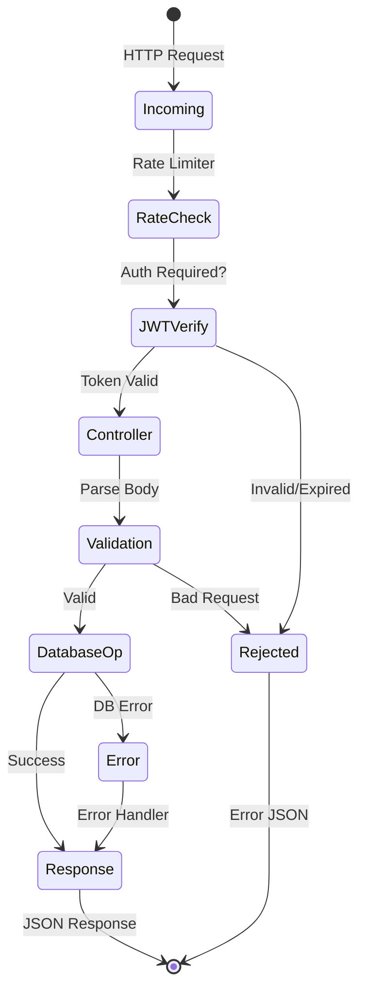

<p align="center">
  
</p>

<p align="center">
  <b>Never Miss a Deadline Again</b><br/>
  An intelligent productivity companion that analyzes tasks, predicts deadline risks,<br/>
  prioritizes work, and creates personalized schedules using AI.
</p>

<p align="center">
  <a href="https://flowsyncai30.vercel.app"></a>
  <a href="https://flowsync-ai-production.up.railway.app"></a>
  <a href="https://github.com/Shubham-997800/FlowSync-Ai"></a>
  <a href="https://github.com/Shubham-997800/FlowSync-Ai/blob/main/LICENSE"></a>
</p>

<p align="center">
  
  
  
  
  
  
  
</p>

---

## Table of Contents

- [Overview](#overview)
- [Features](#features)
  - [AI Capabilities](#-ai-capabilities)
  - [Core Features](#-core-features)
- [Tech Stack](#tech-stack)
- [Architecture](#architecture)
- [Installation](#installation)
- [Configuration](#configuration)
- [API Reference](#api-reference)
- [Project Structure](#project-structure)
- [Deployment](#deployment)
- [Screenshots](#screenshots)
- [License](#license)

---

## Overview

FlowSync AI is a **full-stack MERN application** enhanced with **xAI Grok AI** that transforms how you manage tasks, goals, and habits. It goes beyond simple to-do lists by using artificial intelligence to:

- **Predict deadline risks** before they happen
- **Build optimal daily schedules** based on your workload
- **Prioritize tasks** by urgency, importance, and dependencies
- **Rescue overloaded days** with emergency replanning
- **Generate productivity insights** with personalized recommendations

The app features a **Pomodoro focus timer**, **smart calendar views**, **habit tracking with streaks**, and a **real-time notification system** — all wrapped in a clean, responsive UI with dark mode support.

---

## Features

### 🤖 AI Capabilities

| Feature | Description |
|---------|-------------|
| **AI Chat** | Conversational assistant — type "Schedule standup at 10am tomorrow" and AI creates the task |
| **Daily Planning** | AI analyzes your task list and generates an optimized day schedule with time blocks |
| **Task Prioritization** | Every task gets an AI urgency score + risk level based on deadline proximity and workload |
| **Rescue Mode** | When you're overloaded, AI replans your remaining work, identifies what to drop, and compresses time |
| **Productivity Coach** | Weekly AI reports highlighting patterns, strengths, and areas to improve |

### 📋 Core Features

| Feature | Details |
|---------|---------|
| **Task Management** | Create, edit, delete tasks with priority (high/medium/low), status (todo/in_progress/done), deadlines, and descriptions |
| **Goal Tracking** | Set goals with target dates and track progress with percentage slider |
| **Habit Tracker** | Daily or weekly habits with auto-calculated streaks and a visual weekly grid |
| **Focus Timer** | Pomodoro-style timer with customizable focus (1-180 min) and break (1-60 min) durations, ambient sounds, task integration |
| **Calendar** | Monthly, weekly, and daily views with task deadlines highlighted |
| **Analytics** | Productivity score (animated ring chart), completion rates, focus session stats, weekly/monthly trends |
| **Notifications** | Real-time notification drawer with All/Unread filters, grouped by Today/This Week/Earlier |
| **Dashboard** | Central hub showing task stats, AI priority cards, calendar preview, focus timer, productivity score, and deadline risk indicators |
| **Profile & Settings** | Avatar upload, editable profile (name, bio, phone, location, job title), password change, theme toggle, AI preferences |
| **Dark Mode** | Light, dark, and system-follow themes |

---

## Tech Stack

### Frontend

| Library | Version | Usage |
|---------|---------|-------|
| React | 19.2.7 | UI library with hooks, context API, lazy loading |
| Vite | 8.1.0 | Dev server, HMR, production bundler |
| Tailwind CSS | 4.3.1 | Utility-first styling, responsive design, dark mode |
| React Router | 7.18.0 | Client-side routing with lazy routes |
| Axios | 1.18.1 | HTTP client with JWT interceptor and error handling |
| Lucide React | 1.21.0 | Consistent SVG icon set |
| React Hot Toast | 2.6.0 | Toast notification system |

### Backend

| Library | Version | Usage |
|---------|---------|-------|
| Node.js | 24+ | JavaScript runtime |
| Express | 4.21.0 | REST API framework, middleware pipeline |
| Mongoose | 9.7.3 | MongoDB ODM with schema validation, middleware |
| MongoDB Atlas | — | Cloud database with replica set |
| jsonwebtoken | 9.0.3 | JWT token generation and verification |
| bcryptjs | 3.0.3 | Password hashing (10 salt rounds) |
| Helmet | 8.2.0 | Security headers (XSS, clickjacking, MIME sniffing) |
| express-rate-limit | 8.5.2 | Rate limiting per endpoint group |
| cors | 2.8.6 | Cross-origin resource sharing |
| cookie-parser | 1.4.7 | Cookie parsing middleware |
| morgan | 1.11.0 | HTTP request logging |

### AI & Infrastructure

| Tool | Usage |
|------|-------|
| xAI Grok 4.3 | AI chat, planning, prioritization, rescue mode |
| Railway | Backend hosting with auto-deploy from GitHub |
| Vercel | Frontend hosting with auto-deploy from GitHub |

---

## Architecture



### Data Model



### Authentication Flow



### AI Integration Flow



### Request Lifecycle



---

## Installation

### Prerequisites

- **Node.js** 18+ (tested on 24+)
- **MongoDB Atlas** account (free tier works)
- **xAI API key** — get one at [console.x.ai](https://console.x.ai)

### Clone & Setup

```bash
git clone https://github.com/Shubham-997800/FlowSync-Ai.git
cd FlowSync-Ai
```

### Backend

```bash
cd flowsync-backend
npm install
npm run dev
```

### Frontend

```bash
cd client
npm install
npm run dev
```

The frontend runs on `http://localhost:5173` and the backend on `http://localhost:5000`.

---

## Configuration

### Backend (`flowsync-backend/.env`)

```env
PORT=5000
NODE_ENV=development
MONGODB_URI=mongodb+srv://<user>:<password>@<cluster>.mongodb.net/flowsync?retryWrites=true&w=majority
JWT_SECRET=<your_secret_key>
XAI_API_KEY=<your_xai_api_key>
CLIENT_URL=http://localhost:5173
```

### Frontend (`client/.env`)

```env
VITE_API_URL=http://localhost:5000
```

---

## API Reference

All protected endpoints require `Authorization: Bearer <token>` header.

### Authentication

| Method | Endpoint | Auth | Body | Response |
|--------|----------|------|------|----------|
| POST | `/api/auth/signup` | ❌ | `{ name, email, password }` | `{ token, user }` |
| POST | `/api/auth/login` | ❌ | `{ email, password }` | `{ token, user }` |
| POST | `/api/auth/forgot-password` | ❌ | `{ email }` | `{ message }` |
| POST | `/api/auth/reset-password` | ❌ | `{ token, password }` | `{ message }` |
| GET | `/api/auth/ping` | ❌ | — | `{ message: "pong" }` |

### Tasks

| Method | Endpoint | Auth | Description |
|--------|----------|------|-------------|
| GET | `/api/tasks` | ✅ | List all user tasks |
| POST | `/api/tasks` | ✅ | Create task (title, priority, deadline, description) |
| PUT | `/api/tasks/:id` | ✅ | Update task (whitelisted fields only) |
| DELETE | `/api/tasks/:id` | ✅ | Delete task |

### Goals

| Method | Endpoint | Auth | Description |
|--------|----------|------|-------------|
| GET | `/api/goals` | ✅ | List all goals |
| POST | `/api/goals` | ✅ | Create goal (title, targetDate, description) |
| PUT | `/api/goals/:id` | ✅ | Update goal (whitelisted fields only) |
| DELETE | `/api/goals/:id` | ✅ | Delete goal |

### Habits

| Method | Endpoint | Auth | Description |
|--------|----------|------|-------------|
| GET | `/api/habits` | ✅ | List all habits |
| POST | `/api/habits` | ✅ | Create habit (title, frequency: daily/weekly) |
| PUT | `/api/habits/:id` | ✅ | Update habit |
| DELETE | `/api/habits/:id` | ✅ | Delete habit |
| POST | `/api/habits/:id/checkin` | ✅ | Check in — auto-calculates streak |

### AI

| Method | Endpoint | Auth | Rate Limit | Description |
|--------|----------|------|------------|-------------|
| POST | `/api/ai/chat` | ✅ | 20/min | Conversational AI — create tasks from natural language |
| POST | `/api/ai/plan` | ✅ | 20/min | Generate optimized daily schedule |
| POST | `/api/ai/prioritize` | ✅ | 20/min | Rank tasks by urgency with risk scores |
| POST | `/api/ai/rescue` | ✅ | 20/min | Emergency mode — replan overloaded schedule |

### Analytics

| Method | Endpoint | Auth | Description |
|--------|----------|------|-------------|
| GET | `/api/analytics/stats` | ✅ | Task completion stats |
| GET | `/api/analytics/weekly` | ✅ | Weekly breakdown |
| GET | `/api/analytics/monthly` | ✅ | Monthly breakdown |

### Notifications

| Method | Endpoint | Auth | Description |
|--------|----------|------|-------------|
| GET | `/api/notifications` | ✅ | List latest 50 notifications |
| POST | `/api/notifications` | ✅ | Create notification |
| PUT | `/api/notifications/:id/read` | ✅ | Mark notification as read |

### Settings

| Method | Endpoint | Auth | Description |
|--------|----------|------|-------------|
| GET | `/api/settings/profile` | ✅ | Get user profile |
| PUT | `/api/settings/profile` | ✅ | Update profile (name, email, bio, phone, location, job title) |
| PUT | `/api/settings/avatar` | ✅ | Upload avatar (base64 image string) |
| PUT | `/api/settings/password` | ✅ | Change password (currentPassword, newPassword) |
| DELETE | `/api/settings/account` | ✅ | Delete account (cascades to all user data) |

---

## Project Structure

```
FlowSync-Ai/
│
├── client/                          # React frontend
│   ├── public/
│   ├── src/
│   │   ├── main.jsx                 # Entry point
│   │   ├── App.jsx                  # Root component
│   │   ├── index.css                # Tailwind + global styles
│   │   ├── routes/
│   │   │   └── AppRoutes.jsx        # Lazy-loaded route definitions
│   │   ├── layouts/
│   │   │   └── MainLayout.jsx       # Sidebar + header + theme wrapper
│   │   ├── context/
│   │   │   ├── AuthContext.jsx      # Auth state (useReducer based)
│   │   │   └── ThemeContext.jsx     # Dark/light/system theme
│   │   ├── services/
│   │   │   ├── api.js              # Axios instance with JWT interceptor
│   │   │   ├── authService.js
│   │   │   ├── taskService.js
│   │   │   ├── goalService.js
│   │   │   ├── habitService.js
│   │   │   ├── analyticsService.js
│   │   │   ├── notificationService.js
│   │   │   ├── settingsService.js
│   │   │   └── aiService.js
│   │   ├── components/
│   │   │   ├── Sidebar.jsx
│   │   │   ├── NotificationPopup.jsx
│   │   │   └── ui/                 # Card, Badge, StatCard, ProgressBar, etc.
│   │   ├── pages/
│   │   │   ├── Landing/            # Hero, Features, HowItWorks, CTA, Footer
│   │   │   ├── Authentication/     # Login, Register, ForgotPassword, ResetPassword
│   │   │   ├── Dashboard/          # Stats cards, charts, AI risk, recommendations
│   │   │   ├── TaskManager/        # Task list + Goal list combined
│   │   │   ├── Calendar/           # Monthly/weekly/daily views
│   │   │   ├── FocusMode/          # Pomodoro timer with settings
│   │   │   ├── Habits/             # Weekly tracker with streak display
│   │   │   ├── AIPlanner/          # AI chat, schedule, priority cards, rescue mode
│   │   │   ├── Analytics/          # Charts, trends, AI productivity report
│   │   │   ├── Notifications/      # Notification center with filters
│   │   │   ├── Settings/           # Theme, AI prefs, danger zone
│   │   │   ├── Profile/            # Avatar, personal info, password
│   │   │   ├── Legal/              # Terms of Service, Privacy Policy
│   │   │   └── Error/              # 404, 401 error pages
│   │   └── hooks/                  # Custom React hooks
│   ├── vercel.json                 # SPA routing configuration
│   └── package.json
│
├── flowsync-backend/                # Express API server
│   ├── server.js                   # App entry, middleware setup, route mounting
│   ├── config/
│   │   ├── db.js                   # Mongoose connection with retry logic
│   │   └── aiConfig.js             # xAI Grok client initialization
│   ├── middleware/
│   │   ├── auth.js                 # JWT verification middleware
│   │   └── rateLimiter.js          # Rate limiting strategies
│   ├── models/
│   │   ├── User.js                 # name, email, password (hashed), profile
│   │   ├── Task.js                 # title, priority, status, deadline, description
│   │   ├── Goal.js                 # title, targetDate, progress
│   │   ├── Habit.js                # title, frequency, streak, logs[]
│   │   └── Notification.js         # type, title, message, status, userId
│   ├── controllers/
│   │   ├── authController.js       # signup, login, forgotPassword, resetPassword
│   │   ├── taskController.js       # CRUD with field sanitization
│   │   ├── goalController.js       # CRUD with field sanitization
│   │   ├── habitController.js      # CRUD + check-in + streak calculation
│   │   ├── analyticsController.js  # Stats, weekly, monthly aggregation
│   │   ├── notificationController.js # Create, list, mark-read
│   │   ├── settingsController.js   # Profile CRUD, avatar, password, delete
│   │   └── aiController.js         # Chat, plan, prioritize, rescue
│   ├── routes/
│   │   ├── authRoutes.js
│   │   ├── taskRoutes.js
│   │   ├── goalRoutes.js
│   │   ├── habitRoutes.js
│   │   ├── analyticsRoutes.js
│   │   ├── notificationRoutes.js
│   │   ├── settingsRoutes.js
│   │   └── aiRoutes.js
│   ├── services/
│   │   ├── aiService.js           # xAI Grok API prompt engineering + response parsing
│   │   └── emailService.js        # Nodemailer — password reset emails
│   └── package.json
│
├── .gitignore
├── README.md
└── LICENSE
```

---

## Deployment

### Backend → Railway

The backend auto-deploys from the GitHub repository via Railway.

1. Create a project on [Railway](https://railway.app)
2. Select "Deploy from GitHub repo" → choose `FlowSync-Ai`
3. Set root directory to `flowsync-backend`
4. Add environment variables in Railway dashboard:
   - `MONGODB_URI`, `JWT_SECRET`, `XAI_API_KEY`, `CLIENT_URL`
5. Railway detects Node.js and auto-builds with Nixpacks
6. Each `git push` to `main` triggers a new deployment

### Frontend → Vercel

1. Create a project on [Vercel](https://vercel.com)
2. Import the GitHub repository
3. Set **Root Directory** to `client`
4. Add environment variable: `VITE_API_URL` = your Railway backend URL
5. Vercel detects Vite and auto-configures the build
6. Each `git push` to `main` triggers a new deployment

---

## Screenshots

> *Screenshots coming soon.*

---

## Security

- **JWT authentication** with 30-day token expiry
- **bcryptjs** password hashing with 10 salt rounds
- **Helmet** middleware for security HTTP headers
- **Input sanitization** — all create/update controllers whitelist allowed fields
- **Rate limiting** — auth routes: 5 req/min, AI routes: 20 req/min, general: 100 req/min
- **Mongoose schema validation** — enum checks, required fields, type coercion
- **CORS** restricted to configured `CLIENT_URL`
- **Password excluded** from API responses via Mongoose `toJSON` transform

---

## License

This project is **MIT Licensed**. See [LICENSE](LICENSE) for details.

---

<p align="center">
  Built by <a href="https://github.com/Shubham-997800">Shubham Dangi</a><br/>
  <a href="https://github.com/Shubham-997800/FlowSync-Ai/issues">Report Bug</a>
  ·
  <a href="https://github.com/Shubham-997800/FlowSync-Ai/issues">Request Feature</a>
  ·
  <a href="https://flowsyncai30.vercel.app">Visit App</a>
</p>
